# Free LLM Models

https://build.nvidia.com/deepseek-ai/deepseek-v4-flash
https://openrouter.ai/collections/free-models

# Lab 1: AI Fundamentals - LangChain AI Revolution!

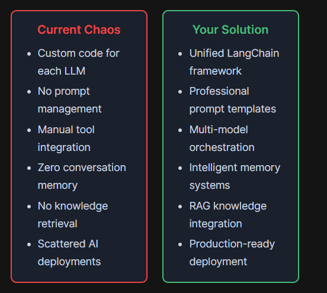

## Langchain Features

1. Template Transformation Pipeline (task 2)
Provide template and variable to create prompt.

2. Connect to Multiple LLMs - Your AI Model Toolkit
Connect to multiple model with same framework and api.

3. LCEL - Master the LangChain Expression Language
- prompt | model | parser
- Streaming First, Async Native, Batch Processing, Type Safety

4. Memory Systems - Master Conversational Context
Build intelligent conversational AI with advanced memory management systems

5. RAG
Retrieval Augmented Generation (RAG) Pipeline


# **Tasks**

# Task 1: Setup - Install LangChain Ecosystem

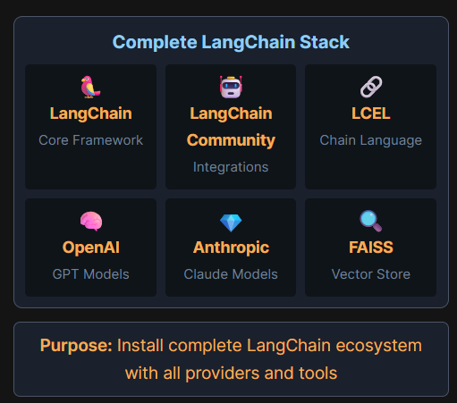

```sh
cd /root && mkdir -p langchain-lab && cd langchain-lab
python3 -m venv venv && source venv/bin/activate
pip install --upgrade pip uv

# Core LangChain packages
uv pip install langchain langchain-community langchain-core langchain-text-splitters langchain-huggingface

# LLM Providers
uv pip install langchain-openai langchain-anthropic langchain-google-genai

# Vector store and embeddings
uv pip install faiss-cpu sentence-transformers

# UI and utilities
uv pip install python-dotenv gradio

echo "LANGCHAIN_INSTALLED" > /root/langchain-ready.txt
```

# Task 2: Master Prompt Templates - The Foundation

## Template Transformation Pipeline

```sh
Template:
"Tell me about {topic}"

+

Variables
topic="LangChain"

=

Result
"Tell me about LangChain"

```

## 💡 Basic Prompt Templates:

Basic templates are the simplest form - a string with placeholders like {variable} that get replaced with actual values.

`basic_template.py`

## 💡 Chat Templates - Conversation Flow

Chat templates structure conversations with different message types: system (instructions), human (user), and assistant (AI) messages.

`chat_template.py`

### 🎭 Message Flow Animation:
- SYSTEM: You are a {role} expert.
- HUMAN: Explain {concept} to me.
- ASSISTANT: I'll explain {concept} as a {role} expert.

## 💡 Few-Shot Templates - Learn by Example

Few-shot templates teach the AI by showing examples. The AI learns the pattern from examples and applies it to new inputs.

```text
Eg: 🧠 Pattern Learning Process:
Example 1: happy → sad ✓
Example 2: tall → short ✓
New Input: hot → ???
AI Prediction: hot → cold 🎯
```

`few_shot_template.py`

## 💡 Advanced Templates - Production Ready

Advanced features include validation, partial variables, output parsers, and conditional logic for production applications.

```text
INPUT:
Template + Variables
→
VALIDATE:
Check Rules
→
OUTPUT:
Safe Prompt
```

`advanced_templates.py`

# Task 3: Connect to Multiple LLMs - Your AI Model Toolkit

## Model Connection Pipeline
```
Model Name:
"openai/gpt-4.1-mini"
Choose your model
→
ChatOpenAI:
OpenAI-compatible
Works with proxy
→
Ready LLM:
model.invoke()
Start chatting!
```

## Your First Model - Getting Started with ChatOpenAI

ChatOpenAI connects to OpenAI-compatible APIs. With our proxy server, you can access multiple models through one interface!

`first_model.py`

## Talking to Models - Messages System

Models understand structured conversations through messages: System (instructions), Human (user), and AI (assistant) messages.

### 🎭 Message Flow:
- SYSTEM: You are a helpful assistant
- HUMAN: What's your name?
- AI: I'm your AI assistant!

`messages_demo.py`

## Model Configuration - Fine-tuning Behavior

Control your model's behavior with temperature: 0 = precise & consistent, 1 = creative & varied.

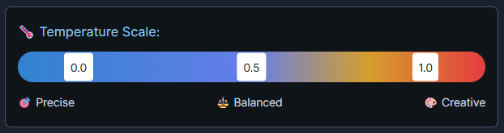

`model_config.py`

## Multiple Models - The Right Tool for Each Job

Different models excel at different tasks. Choose the right model for speed, cost, or capability!

### 🎯 Model Specializations:
- ⚡ Fast & Low-cost: Simple tasks, quick responses
- 🧠 Reasoning: Complex logic, analysis
- 💻 Coding: Programming, algorithms
- 💬 Chat: Conversations, creativity

`multiple_models.py`

# Task 4: LCEL - Master the LangChain Expression Language

## LCEL Chain Flow

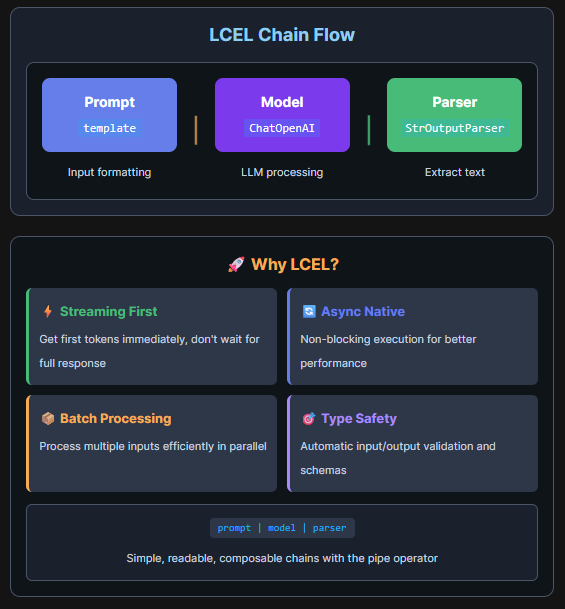

## Sequential Chains - The Pipeline Pattern

LCEL uses the pipe operator | to chain components. Data flows left to right: input → prompt → model → parser → output.

`sequential_chain.py`

## Parallel Execution - RunnableParallel for Speed

RunnableParallel executes multiple chains concurrently, reducing latency. Perfect for independent operations like generating multiple responses or calling different models simultaneously.

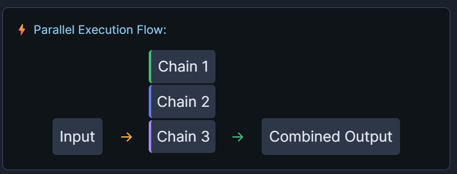

`parallel_chains.py`

## Dynamic Routing - RunnableLambda & Conditional Logic

RunnableLambda allows custom Python functions in chains. Use it for data transformation, conditional routing, or any custom logic between chain steps.

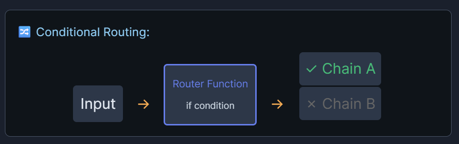

`dynamic_routing.py`

## Advanced LCEL - Streaming, Batch & Error Handling

LCEL provides built-in support for streaming (get tokens as they arrive), batch processing (handle multiple inputs efficiently), and fallback chains for error handling.

`advanced_lcel.py`

# Task 5: Memory Systems - Master Conversational Context

## Memory Flow
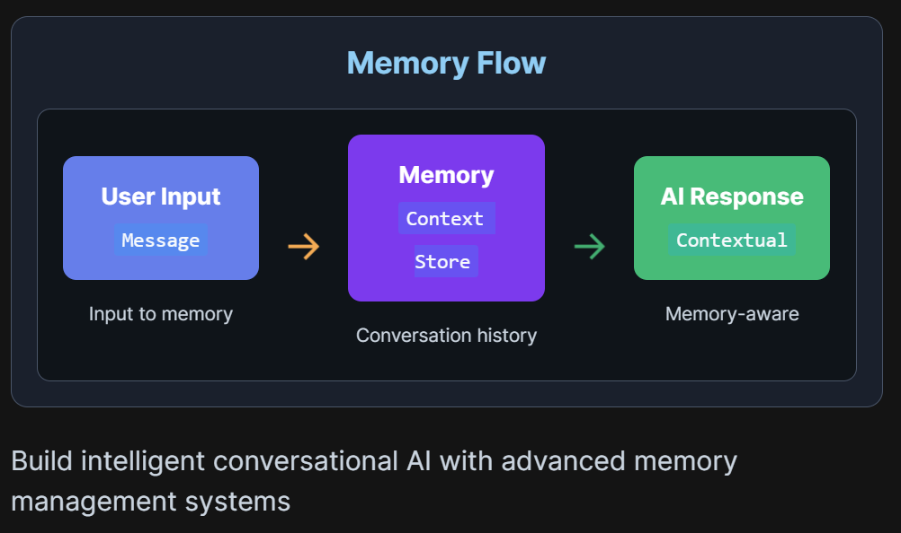

## Memory Fundamentals - Building Conversational Context

### 📊 How Buffer Memory Works:

Messages in Buffer:
[1] "Hi, I'm Alice" ← stored
[2] "I like Python" ← stored
[3] "What's my name?" ← stored
→ AI recalls: "You're Alice and you like Python"

Master the core memory types that power conversational AI:

`memory_fundamentals.py`

## Advanced Memory Types - Smart Context Management

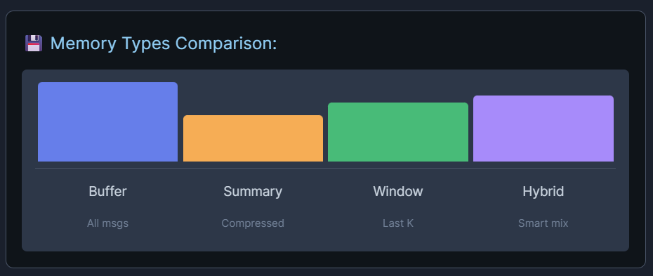

Implement intelligent memory strategies for production applications:

`advanced_memory.py`

# Task 6: RAG - Knowledge-Augmented Chatbot

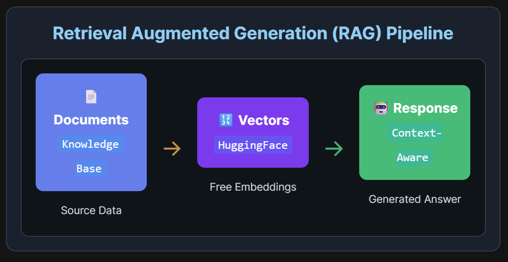

## Document Loading & Chunking - Prepare Your Knowledge

Load documents from various sources (text, PDF, web) and split them into manageable chunks for efficient retrieval and processing.

`document_loader.py`

## Vector Store Creation - Free Embeddings with HuggingFace

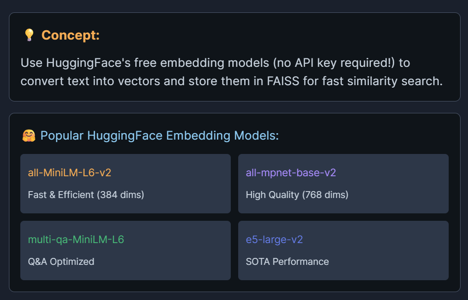

`retrieval_chain.py`

# Task 7: Launch Your LangChain AI Assistant

Purpose: Deploy and interact with your complete LangChain chatbot via Gradio interface

## Step 1: Start the Chatbot

```sh
cd /root/langchain-chatbot
chmod +x run.sh
./run.sh
```
⏱️ Wait 30 seconds for FAISS vector database initialization

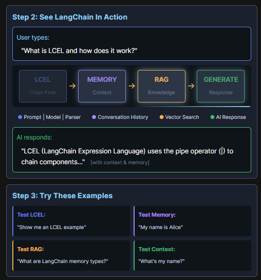
