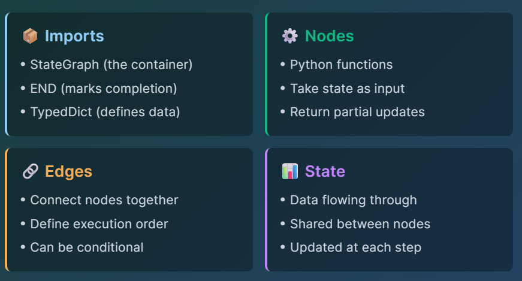
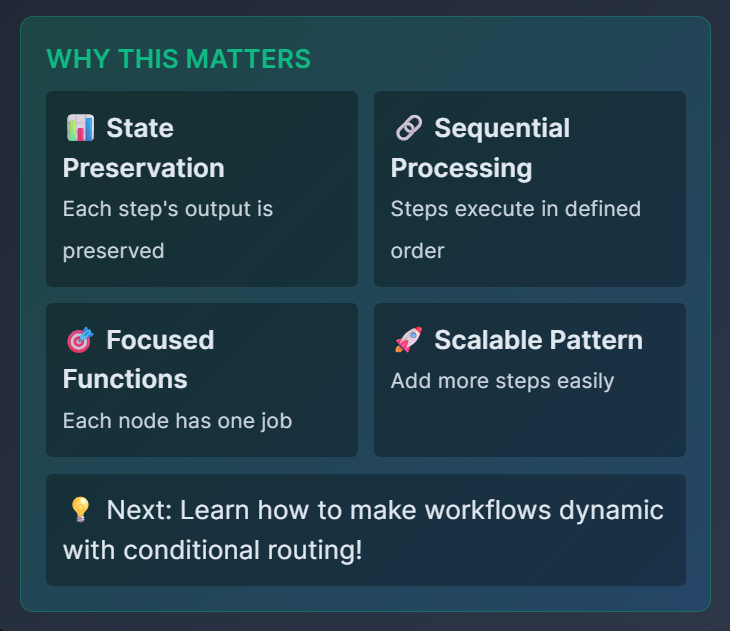
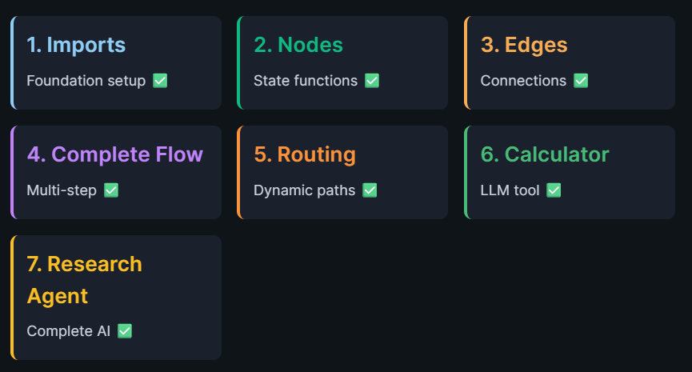

# LangGraph Basics: Build Stateful AI Workflows

## What is LangGraph?
LangGraph is a framework for building stateful, multi-step AI workflows using graphs. Unlike simple LLM chains, LangGraph gives you explicit control over how data flows through your application, enabling complex decision-making, loops, and conditional routing.

## Master the Fundamentals Step by Step
Learn LangGraph progressively - from basic imports to building a complete research assistant with multiple tools.

## Your 7-Step Learning Journey

- 1️⃣ Imports: Foundation setup
- 2️⃣ Nodes: State functions
- 3️⃣ Edges: Connect nodes
- 4️⃣ Complete Flow: Multi-step
- 5️⃣ Routing: Conditionals
- 6️⃣ Calculator: LLM tool
- 7️⃣ Research Agent: Complete AI

```
Build progressively:
Start with imports → End with a complete research assistant!
```

# Environment Setup

## Installing LangGraph
What Gets Installed:
```
langgraph - Stateful graph framework
langchain - Core LLM abstractions
langchain-openai - OpenAI integration
duckduckgo-search - Web search tool
```

## Pre-configured:
OpenAI proxy at OPENAI_API_BASE

```sh
# Run Setup
cd /root && source /root/venv/bin/activate

pip install langgraph langchain langchain-openai duckduckgo-search
python3 /root/code/verify_environment.py
```

# Task 1: 🧩 LangGraph Building Blocks

## THE ESSENTIAL PIECES
Before we dive in, let's understand what we'll be building with:



## 🎯 SIMPLE EXAMPLE
Think of it like a recipe:
1. Ingredients (State) = Your data
2. Steps (Nodes) = Functions that transform data
3. Instructions (Edges) = "Do this, then that"
4. Recipe Book (StateGraph) = Puts it all together!

✨ You'll build these step by step in the following tasks!

## 💡 Key Learning:
StateGraph creates workflows, END marks completion, State holds data

```sh
python3 /root/code/task_1_understanding_imports.py
```

# 🔷 Task 2: Creating Your First Node

## ⚙️ Functions That Process State
📁 Select task_2_creating_nodes.py from the explorer

## ✏️ Complete the TODOs:
```
Line 68: Return greeting: return {"greeting": greeting}
Line 77: Return enhanced greeting: return {"greeting": enhanced}
```

💡 Key Learning:
Nodes are functions that take state and return partial updates

#  Task 3: 💡 How Nodes Transform State

## THE NODE PATTERN
Every node follows the same simple pattern:

```sh
def my_node(state: State):
    # Process the current state
    result = do_something(state['field'])
    # Return partial update
    return {'field': result}
```

✅ Input: Full state | ✅ Output: Partial update | ✅ LangGraph merges automatically

## STATE ACCUMULATION

Initial: {"name": "Alice", "greeting": ""}
After Node 1: {"name": "Alice", "greeting": "Hello Alice"}
After Node 2: {"name": "Alice", "greeting": "✨ Hello Alice ✨"}

🔑 Each node adds to the state without destroying previous data!

## 💡 Key Learning:
StateGraph + add_node + add_edge = Complete workflow!

```sh
python3 /root/code/task_3_connecting_edges.py
```

# 🎯 Task 4: Complete LangGraph Flow

💡 Key Learning: Multi-node workflows process data in stages

```sh
python3 /root/code/task_4_complete_flow.py
```

# Task 5: 🔄 Workflow Patterns in LangGraph

## MULTI-STEP PROCESSING
You've built your first multi-step workflow! Here's the pattern:

```
Step 1: Outline
Initial processing - creates foundation
Step 2: Draft
Builds on outline - adds detail
Step 3: Review
Finalizes content - polishes output
```



```
python3 /root/code/task_5_conditional_routing.py
```

# 🧮 Task 6: Simple Calculator Tool

💡 Key Learning:
Tools are nodes with specific functions, LLM can act as calculator
```
python3 /root/code/task_6_calculator_tool.py
```

# 🔬 Task 7: Research Agent

💡 Key Learning: Smart routing between multiple tools based on query type

```sh
python3 /root/code/task_7_research_agent.py
```

# Conclusion

## You Mastered LangGraph Basics - All 7 Tasks Complete!



## 🚀 Your Learning Journey
From basic imports to a complete research agent - you've mastered:

- Setting up LangGraph components
- Creating and connecting nodes
- Building multi-step workflows
- Implementing conditional routing
- Integrating LLM tools
- Combining multiple capabilities

🎯 Next: Memory systems, human-in-the-loop, multi-agent orchestration!
