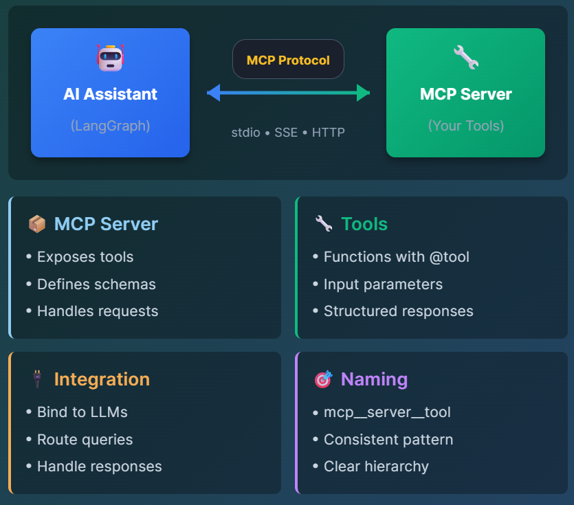

# Advanced MCP Concepts: Extend LangGraph with External Tools

## What is MCP?
Model Context Protocol (MCP) is an open protocol for connecting AI to external tools. Think of it as a USB port for AI - a standardized way for models to interact with databases, APIs, and services.

## Build on Your LangGraph Knowledge
Extend your LangGraph agents with MCP servers - from simple calculator tools to orchestrating multiple services.

## Your 3-Step MCP Journey

- 📡 MCP Basics: Create server
- 🔌Integration: Connect to LangGraph
- 🌐 Multi-Server: Orchestrate tools

```
From simple tools to multi-server orchestration - Master MCP!
```

# Environment Setup

## Installing MCP + LangGraph
What Gets Installed:
```
langgraph - Stateful graph framework
langchain - Core LLM abstractions
langchain-openai - OpenAI integration
langchain-mcp-adapters - MCP integration adapters
Future: fastmcp - MCP server framework
```

## Pre-configured:
OpenAI proxy at OPENAI_API_BASE

```
cd /root && source /root/venv/bin/activate
pip install langgraph langchain langchain-openai langchain-mcp-adapters

python3 /root/code/verify_environment.py
```

# Task 1: 🧩 Understanding MCP Architecture

## THE MCP ECOSYSTEM
MCP creates a bridge between AI and external tools:



## 🎯 SIMPLE EXAMPLE
Think of MCP like USB devices:
1. USB Port (MCP Protocol) = Standard connection
2. Device (MCP Server) = Calculator, Weather, etc.
3. Functions (Tools) = What the device can do
4. Computer (LangGraph) = Uses the devices!

## 💡 Key Learning:
MCP servers expose tools via decorators, tools are tested directly, production servers run with mcp.run()

## 📡 Task 1: Understanding MCP Basics
```
python3 /root/code/task_1_mcp_basics.py
```

## ⚠️ IMPORTANT:
Server Runs Continuously for clients to communicate in production environments

After running the command above, the MCP server will start and run continuously. This is normal behavior for MCP servers!

✅ Keep Terminal 1 open - The server must stay running
✅ You'll see "Server ready! Waiting for client connections..."
✅ Task 1 is marked complete automatically before server starts
✅ Open a new terminal (Terminal 2) for the next tasks

❌ Press Ctrl+C after you finish this MCP task as the next task will call the server automatically!

# 🔌 Task 2: MCP and LangGraph Integration

## ⚠️ PREREQUISITE:
Task 1 Server Must not be Running
Before starting Task 2, ensure:

✅ Terminal 1:
Task 1 MCP server is not running (showing "Server ready!")
✅ Terminal 2:
Open a NEW terminal for Task 2

❌ If Task 1 server is running, this task will not fail as the code again calls the same server!

## 💡 Key Learning:
MCP client connects to running server, loads tools dynamically, binds to LangGraph agent

```
python3 /root/code/task_2_mcp_langgraph.py
```

# 🌐 Task 3: Multiple MCP Servers

## 💡 Key Learning:
Multiple servers work together, intelligent routing is key, extensible architecture

```
python3 /root/code/task_3_multi_servers.py
```
