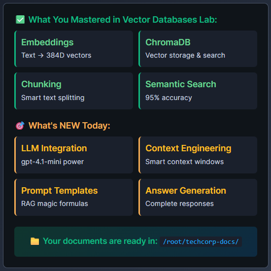
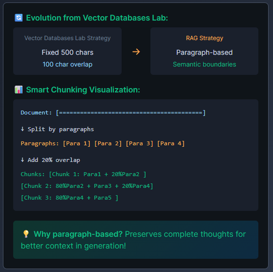
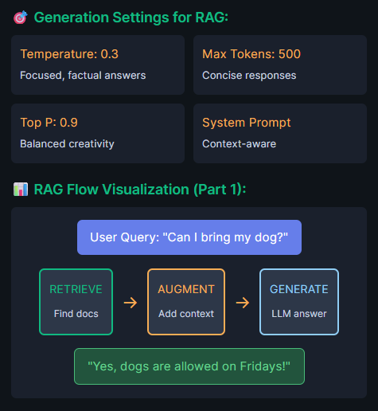
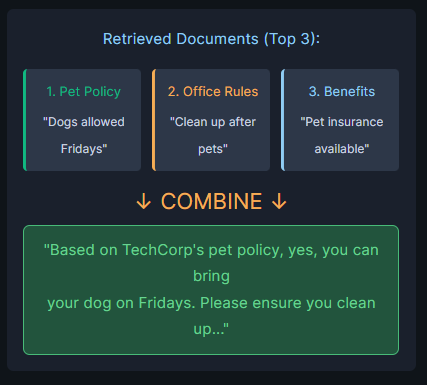
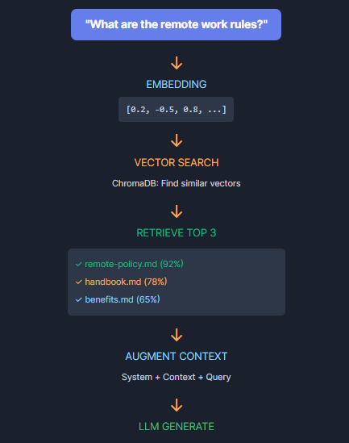

# 🚀 From Search to Answers: The RAG Revolution

## Remember Your Vector Databases Lab Achievement?
You built semantic search with 95% accuracy that finds "remote work policy" when someone searches "work from home"!

But the CEO wants MORE...

## 📢 CEO's New Challenge:
"Don't just FIND the document, ANSWER the question! I want our system to say 'Yes, you can work 3 days from home' not just show me a policy document!"

## 🎯 Today's Mission: Add AI Generation!
Transform your semantic search into a complete RAG (Retrieval-Augmented Generation) system that:

- RETRIEVES relevant documents (you built this!)
- AUGMENTS with context
- GENERATES perfect answers

🚀 Ready to give your search system a brain that can think and answer?

# 🔧 Environment Setup

## 📦 Installing RAG Libraries

### What Gets Installed:
```
✅ chromadb - Vector database (you know this!)
✅ sentence-transformers - Embedding models
✅ langchain - RAG framework
✅ langchain-openai - OpenAI integration for LangChain
✅ langchain-community - Vector store integrations
✅ langchain-huggingface - HuggingFace embeddings
✅ numpy - Vector mathematics
```

### 🤖 Pre-configured:
- OpenAI API proxy at OPENAI_API_BASE
- Model: gpt-4.1-mini for generation

## 🚀 Run Setup Commands

```sh
cd /root && source /root/venv/bin/activate

pip install chromadb sentence-transformers langchain langchain-openai langchain-community langchain-huggingface numpy

python3 /root/code/verify_environment.py
```

## 📚 Quick Recap & New Powers



Here, `/root/techcorp-docs` have multiple md files for policies, products, supports, handbook, faqs.

# 🎯 Understanding Task 1: Foundation for RAG

## What You're Building:
- ChromaDB Client: Your vector database to store document embeddings
- Collection: A named container for organizing your TechCorp documents
- Embedding Model: Converts text into 384-dimensional vectors for semantic understanding

## 🔑 Key Concept:
This creates the infrastructure that RAG needs to store and retrieve document chunks based on meaning, not just keywords. Think of it as building the "brain's memory" where your AI will search for answers!

## 🔧 Task 1: Environment & Vector Store Setup

`python3 /root/code/task_1_setup_vectorstore.py`

💡 Remember: You mastered this in Vector Databases Lab - now apply it for RAG!


# Task 2: ✂️ Advanced Chunking for RAG



## 📄 Task 2: Smart Document Processing

`python3 /root/code/task_2_document_processing.py`

# Task 3: 🤖 Adding AI Generation Power

## ⚙️ LLM Configuration (Pre-configured for you!):

```
Model: openai/gpt-4.1-mini
API Base: OPENAI_API_BASE (env variable)
API Key: OPENAI_API_KEY (env variable)
```



`python3 /root/code/task_3_llm_integration.py`

# Task 4: 🎯 The Secret RAG Prompt Formula

## 📝 System Prompt Template:
```
"You are TechCorp's helpful AI assistant.
Answer ONLY based on the provided context.
If the answer is not in the context, say:
'I don't have that information in the provided documents.'"
```

## 📋 User Prompt Structure:
```
Context:
{retrieved_chunk_1}
{retrieved_chunk_2}
{retrieved_chunk_3}
Question: {user_query}
Answer:
```

## 🔄 Context Injection Visualization:



## 📝 Task 4: Prompt Engineering

`python3 /root/code/task_4_prompt_engineering.py`

# Task 5: ⚡ Complete RAG Pipeline

## 🔄 The Complete Pipeline Flow:
1. User asks question
2. Convert to embedding (384D vector)
3. Search ChromaDB (semantic similarity)
4. Retrieve top 3 chunks (with metadata)
5. Build context prompt (system + context + query)
6. Generate with LLM (gpt-4.1-mini)
7. Return answer with sources

## 🎬 Complete RAG Animation:



"Based on TechCorp's remote work policy, you can work remotely up to 3 days per week. Core hours are 10 AM to 3 PM in your local timezone..."

📎 Sources: remote-policy.md

## 🚀 Task 5: Complete RAG Pipeline

`task_5_complete_rag.py`

# 🎉 RAG Mastery Achieved!

## 📈 Your AI Evolution Journey
```
Vector Databases Lab:
Found relevant docs
`95% accuracy`

+

RAG Lab: Complete System:
Generated answers
`Complete AI Q&A`
```

## 🔄 The Transformation:
```
Before: "Document not found" 😞

Vector Databases Lab: "Found: remote-work-policy.pdf" 📄

Now: "Based on our policy, you can work 3 days from home with core hours 10-3PM" 🎯
```

## 🏆 What You Built

A production-ready RAG system that retrieves, augments, and generates!
The same technology that powers ChatGPT, Claude, and Gemini!

- 📚 Smart Chunking
- 🔍 Semantic Search
- 🤖 AI Generation

## 🚀 Next Adventure: LangGraph - AI Agent Orchestration
Build stateful multi-agent systems with decision trees and workflows!
