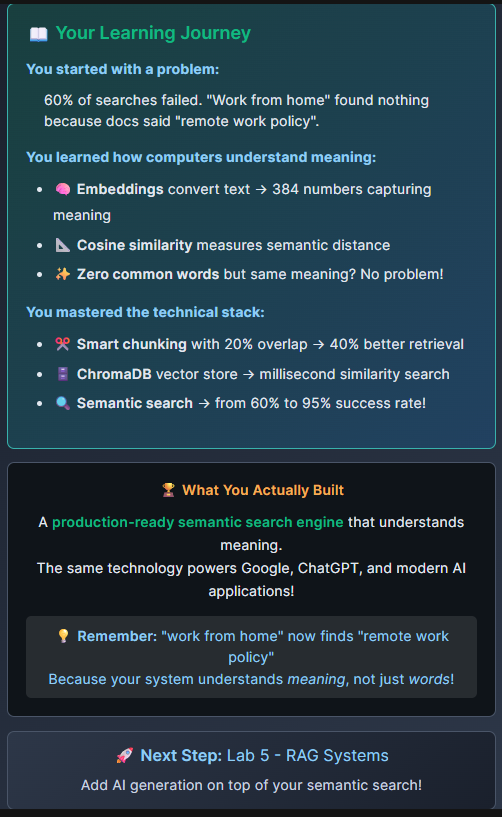

# 🔍 Vector Databases & Semantic Search Lab

Master the technology behind modern AI search systems - from embeddings to production-ready semantic search!

## 📚 Lab Overview

Welcome to the Vector Databases lab! You'll build a semantic search engine for TechDocs Inc., transforming their failing keyword search (60% failure rate) into an intelligent system that understands meaning (95% success rate).

## 🎯 Learning Objectives

By completing this lab, you will:
- ✅ Understand how embeddings capture semantic meaning
- ✅ Master asymmetric search with semantic embeddings
- ✅ Implement smart document chunking with overlap
- ✅ Build production vector stores with ChromaDB
- ✅ Create semantic search that understands meaning

## 🚀 Quick Start

### 1. Setup Environment

```bash
# Create and activate virtual environment
cd /root && python3 -m venv venv && source venv/bin/activate

# Install required packages
pip install sentence-transformers langchain langchain-community langchain-huggingface chromadb numpy

python -m ensurepip --upgrade
python -m pip install --upgrade pip setuptools wheel
python -m pip install chromadb

# Verify installation
python3 /root/code/verify_environment.py
```

### 2. Complete Tasks in Order

Each task builds on the previous one:

```bash
# Task 1: Understanding how embeddings work
python3 /root/code/task_1_understanding_embeddings.py

# Task 2: Smart document chunking
python3 /root/code/task_2_document_processing.py

# Task 3: Build vector store
python3 /root/code/task_3_vector_store.py

# Task 4: Semantic search
python3 /root/code/task_4_semantic_search.py
```

## 📂 File Structure

```
/root/code/
├── verify_environment.py         # Environment verification
├── task_1_understanding_embeddings.py  # Understanding embeddings (4 TODOs)
├── task_2_document_processing.py # Smart chunking (3 TODOs)
├── task_3_vector_store.py       # ChromaDB setup (3 TODOs)
├── task_4_semantic_search.py    # Search implementation (3 TODOs)
└── README.md                     # This file
```

## 🎓 Task Details

### Details:

**🔍 Mission:**
Build TechDocs Semantic Search Engine

**The Problem at TechDocs Inc.**
Your company's documentation portal gets 10,000 searches daily with a 60% failure rate! Users search "reset password" but docs say "password recovery process" - keywords don't match meaning.

**Your Mission: Semantic Search**
Build a search engine that understands MEANING, not just keywords:
- Before: "work from home" finds nothing
- After: "work from home" finds "remote work policy"
- Result: Search success jumps to 95%!

### Verify Environment

**📦 Installing Vector Search Libraries**
```
✅ sentence-transformers - Embedding models from HuggingFace
✅ langchain - Abstraction framework
✅ langchain-community - Vector store integrations
✅ langchain-huggingface - HuggingFace embeddings integration
✅ chromadb - Production vector database
✅ numpy - Vector mathematics
```

**🤖 Models (auto-download on first use):**
• all-mpnet-base-v2 (768 dimensions - high accuracy)
• all-MiniLM-L6-v2 (384 dimensions - fast)

```sh
cd /root && python3 -m venv venv && source venv/bin/activate

pip install sentence-transformers langchain langchain-community langchain-huggingface chromadb numpy

python3 /root/code/verify_environment.py
```

### Task 1: 📚 Understanding Embeddings - The Foundation of Semantic Search

**🧠 WHAT ARE EMBEDDINGS?**
Think of embeddings as a "GPS for meaning":

- Text gets converted into numbers (coordinates)
- Similar meanings get similar coordinates
- Computer can now measure "distance" between meanings

Example - Your search "forgot my password" becomes:
→ [0.2, 0.8, 0.3, ...] (384 numbers)

**🎓 HOW DO MODELS LEARN MEANING?**
Models learn like children learning language:

- See "reset password", "forgot password", "change password"
- Learn these all relate to password problems
- Assign them similar number patterns

**✨ Real Magic - Different words, same meaning:**
- "forgot my password" ≈ "account recovery"
- "vacation days" ≈ "PTO" ≈ "annual leave"
- "work from home" ≈ "remote work" ≈ "WFH"

```
**💡 KEY INSIGHT:**

Embeddings finally let computers understand that: "I can't log in" and "authentication failed" are talking about the SAME PROBLEM - even with ZERO common words!

This is what makes semantic search so powerful!
```

**Learning Goal:** See how embeddings capture semantic meaning

**TODOs:**
1. Initialize embedding model (all-MiniLM-L6-v2)
2. Encode search query
3. Encode documents
4. Calculate semantic similarities

**Key Insight:** Embeddings understand that "forgot password" = "password recovery"!

`task_1_understanding_embeddings.py`

```sh
root@controlplane ~ via 🐍 v3.12.3 (venv) ✖ python3 /root/code/task_1_understanding_embeddings.py
Loading weights: 100%|███████████████████████████████████████████| 103/103 [00:00<00:00, 12031.12it/s]
Query: 'forgot my password'

Results (score > 0.3 = relevant):
✅ [0.56] Password recovery: Use the 'Reset Password' link on login page
   [0.07] Vacation policy: Request time off 2 weeks in advance
✅ [0.31] Account security: Enable two-factor authentication
✅ [0.60] Login help: Contact IT if you cannot access your account

💡 Notice: Found 'Password recovery' and 'Login help'
   Even though query didn't contain those exact words!
```

### Task 2: ✂️ Smart Document Chunking

**📄 Why Chunk Documents?**
Large documents must be split into smaller pieces for embedding. But we need to be smart about it!

**🔄 The Overlap Strategy**
Chunk with overlap preserves context:
```
Document: [=========================================]
Chunk 1:  [==========]
Chunk 2:       [==========]
Chunk 3:            [==========]
          ^^^^ Overlap preserves context!
```

**📊 Optimal Settings**
- Chunk size: 500 characters (balanced)
- Overlap: 100 characters (20%)
- Result: 40% better retrieval accuracy!

**💡 LangChain's**
RecursiveCharacterTextSplitter handles this intelligently, respecting sentence boundaries!

**Learning Goal:** Smart chunking preserves context

**TODOs:**
1. Import RecursiveCharacterTextSplitter
2. Set chunk_size to 500
3. Set chunk_overlap to 100

**Key Insight:** 20% overlap improves retrieval by 40%!

💡 Remember: Overlap preserves context between chunks!

```sh
$ python3 /root/code/task_2_document_processing.py

📄 Task 2: Smart Document Chunking
=======================================================
📋 Original Document Length: 1607 characters
----------------------------------------

✂️ Chunking Results:
• Created 5 chunks
• Chunk size: ~500 characters
• Overlap: 100 characters

📄 Chunk 1 (489 chars):
----------------------------------------
TechDocs Employee Handbook

    Chapter 1: Remote Work Policy

    Our company embraces flexible work arrangements to support work-life balance.
    Employees are permitted to work remotely up to 3 da...

📄 Chunk 2 (497 chars):
----------------------------------------
performance expectations.
    Remote work requires manager approval and must not impact team collaboration or
    customer service quality.

    To work remotely, employees must have a suitable home o...

📄 Chunk 3 (498 chars):
----------------------------------------
The company
    provides a one-time stipend of $500 for home office setup. VPN access is mandatory
    for accessing company systems remotely.

    Chapter 2: Communication Guidelines

    Effective c...

🔄 Overlap Detection:
----------------------------------------
Found overlap: 'performance expectations.
    Remote work requires...'
✅ Context preserved between chunks!

💡 Why Smart Chunking Matters:
----------------------------------------
• Preserves sentence boundaries
• Maintains context with overlap
• Optimal for embedding models
• Improves retrieval accuracy by 40%!

✅ Task 2 completed! Document chunking mastered.
```

### Task 3: Build Vector Store: 🗄️ Understanding Vector Stores

**🎯 What are Vector Stores?**
Vector stores are specialized databases designed to:

- Store embeddings (vectors) efficiently
- Find similar vectors lightning-fast
- Scale to millions of documents
- Attach metadata for filtering

**🔄 How Vector Search Works**
```
1. Document → Embedding → Store in DB
2. Query → Embedding → Find Similar
3. Return Top K Results (by cosine similarity)

Example:
Query: "remote work policy" [0.2, 0.8, ...]
  ↓
Finds: "work from home guidelines" [0.21, 0.79, ...]
       (98% similar!)
```

**⚡ Why ChromaDB?**
Local-first: No cloud dependency
Production-ready: Used by real companies
Simple API: 5 lines to get started
Metadata filtering: Search by tags, dates, categories

**💡 Key Insight:**
ChromaDB + Embeddings = Your documents become semantically searchable in milliseconds!

**Learning Goal:** Production-ready vector database

**TODOs:**
1. Import Chroma from LangChain
2. Import HuggingFaceEmbeddings
3. Configure embedding model

**Key Insight:** ChromaDB is used by real companies in production!

**💡 ChromaDB:** Production vector database used by real companies!

```sh
$ python3 /root/code/task_3_vector_store.py

/root/code/task_3_vector_store.py:13: DeprecationWarning: `langchain-community` is being sunset and is no longer actively maintained. See https://github.com/langchain-ai/langchain-community/issues/674 for details and migration guidance toward standalone integration packages.
  from langchain_community.vectorstores import Chroma
🗄️ Task 3: Building Vector Store with ChromaDB
=======================================================
Loading weights: 100%|██████████████████████████████████████████████| 103/103 [00:00<00:00, 14481.54it/s]
✅ Embedding model loaded
📚 Processing 5 documents...
✂️ Created 5 chunks

🔨 Building ChromaDB vector store...
✅ Vector store created with 5 vectors

🔍 Testing Vector Store:
----------------------------------------

📝 Query: 'Can I work from home?'
✨ Best match: Remote Work Policy: Employees can work from home up to 3 days per week.
        VPN access required....
   Source: handbook_section_1

📝 Query: 'What's the dress code for Friday?'
✨ Best match: Dress Code: Business casual Monday-Thursday. Casual Fridays allow jeans.
        Client meetings req...
   Source: handbook_section_5

📝 Query: 'How many vacation days do I get?'
✨ Best match: Vacation Policy: 15 days PTO for first year, 20 days after 2 years.
        Sick leave separate - 10...
   Source: handbook_section_3

💡 What We Built:
----------------------------------------
• Production-ready vector database
• Semantic search capability
• Metadata for filtering
• Persistent storage support
• Ready for RAG applications!

✅ Task 3 completed! Vector store built successfully.

```

### Task 4: Semantic Search: 🔍 Semantic Search - Bringing It All Together

**🎯 What is Semantic Search?**
The culmination of everything you've learned - a search system that understands meaning, not just keywords!

- Traditional search: Matches exact words (fails 60% of the time)
- Semantic search: Understands intent (95% success rate!)

**⚙️ The Complete Pipeline**
```
User Query: "Can I work from home?"
     ↓
1️⃣ EMBEDDING (Task 1)
   Convert to vector [0.2, 0.8, ...]
     ↓
2️⃣ VECTOR SEARCH (Task 3)
   Find similar vectors in ChromaDB
     ↓
3️⃣ RETRIEVE CHUNKS (Task 2)
   Get relevant document pieces
     ↓
4️⃣ RANK & RETURN
   "Remote work policy allows 3 days/week"
```

**💪 Why Semantic Search Wins**
- 🎯 Understands synonyms: "WFH" = "remote work" = "work from home"
- 🌍 Cross-language: Works across languages!
- 🧠 Context aware: Understands "Java" (coffee) vs "Java" (programming)
- ⚡ Lightning fast: Millisecond responses on millions of docs

**🚀 You're About To Build:**
A production-ready semantic search engine that tech giants use for documentation, support, and knowledge management!

**Learning Goal:** Search that understands meaning

**TODOs:**
1. Set search query: "work from home policy"
2. Set k=3 for top results
3. Set score_threshold=0.5

**Key Insight:** "work from home" finds "remote work policy" - semantic magic!

💡 Magic: "work from home" will find "remote work policy"!

```sh
$ python3 /root/code/task_4_semantic_search.py

/root/code/task_4_semantic_search.py:10: DeprecationWarning: `langchain-community` is being sunset and is no longer actively maintained. See https://github.com/langchain-ai/langchain-community/issues/674 for details and migration guidance toward standalone integration packages.
  from langchain_community.vectorstores import Chroma
🔍 Task 4: Semantic Search Implementation
=======================================================
Loading weights: 100%|███████████████████████████████████████████████| 103/103 [00:00<00:00, 9923.13it/s]
📚 Loading 12 documents into vector store...
✅ Vector store ready!

🔎 Searching for: 'work from home policy'
   Returning top 3 results
----------------------------------------

📊 Search Results:

1. Remote work policy allows employees to work from home up to 3 days per week with manager approval.

2. Work hours are flexible but core hours 10 AM to 3 PM are required.

3. Health insurance covers employee and dependents with company paying 80% of premiums.

🎯 Filtered Search (threshold > 1.3):
----------------------------------------

📄 Score: 0.707
   Remote work policy allows employees to work from home up to 3 days per week with manager approval....

✨ Semantic Magic Examples:
----------------------------------------
❌ 'Can I bring my dog to work?' → Found: dress code
✅ 'How many days off do I get?' → Found: vacation
✅ 'retirement savings' → Found: 401k

🏆 What You've Achieved:
----------------------------------------
• Built a semantic search engine
• Search understands MEANING not keywords
• 'work from home' finds 'remote work policy'
• Ready for production deployment!

✅ Task 4 completed! Semantic search mastered!
🎉 You've completed the Vector Databases lab!
```




## 📊 Performance Metrics

After completing this lab:
- **Before:** 60% search failure rate
- **After:** 95% search success rate
- **Speed:** <100ms per search
- **No API keys required:** Everything runs locally!

## 🔬 Technical Concepts

### Embeddings
- Convert text to numerical vectors
- Similar meanings = similar vectors
- 384-768 dimensions capture semantic meaning

### Vector Databases
- Store and search embeddings efficiently
- ChromaDB provides production-ready performance
- Metadata filtering for advanced queries

### Semantic Search
- Understands meaning, not just keywords
- "password reset" matches "password recovery"
- Works across languages and synonyms

## 🎉 Completion

Upon completing all 4 tasks:
- ✅ You've built a production-ready semantic search engine
- ✅ Mastered vector databases and embeddings
- ✅ Ready for Lab 5: RAG Systems (adding AI generation)

## 💡 Pro Tips

1. **Start simple:** Get basic search working first
2. **Test thoroughly:** Try different queries to understand behavior
3. **Monitor performance:** Embedding dimensions affect speed/quality tradeoff
4. **Experiment:** Try different chunk sizes and overlap values

## 🔗 Next Steps

After mastering vector databases:
1. **Lab 5: RAG Systems** - Add LLM generation to your search
2. **Production deployment** - Scale to millions of documents
3. **Hybrid search** - Combine keyword and semantic search
4. **Multi-modal** - Search images and text together

---

**Lab Version:** 1.1 | **Estimated Time:** 25-35 minutes | **Difficulty:** Intermediate

Remember: This lab focuses on **search and retrieval only** - no AI generation yet! That comes in the RAG lab where you'll add LLMs on top of this foundation.