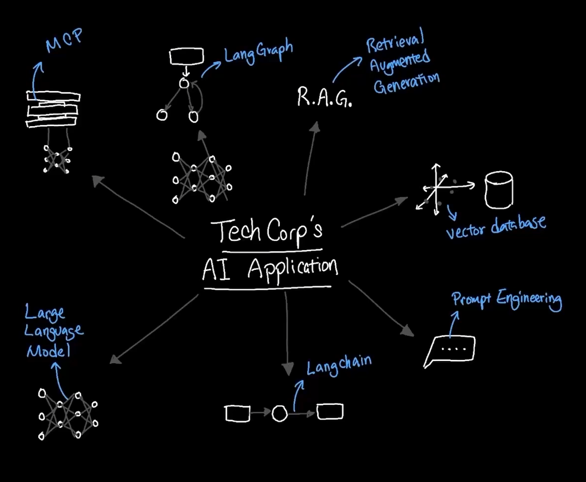
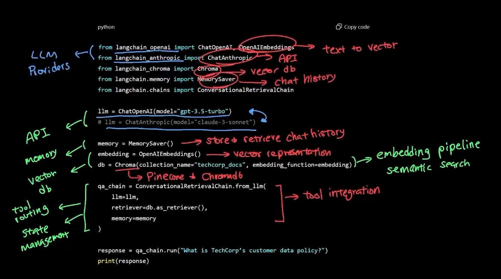
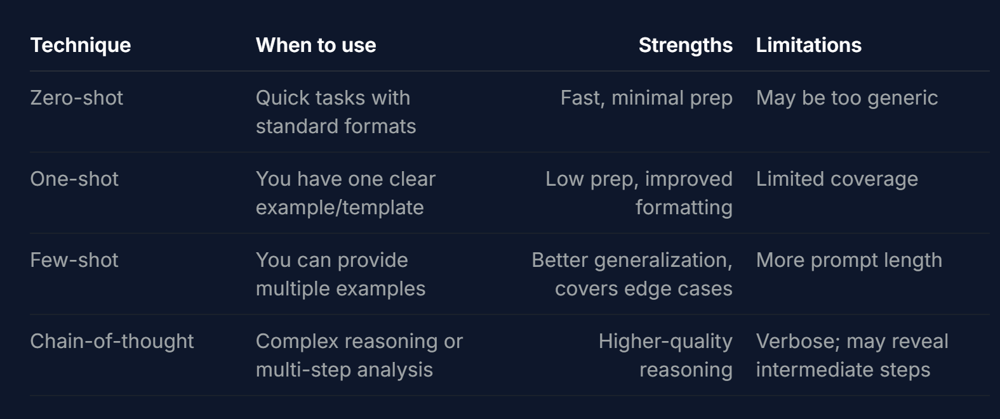

# **AI Agent Fundamentals**

---

# AI Part 1

https://notes.kodekloud.com/docs/AI-Agents-Fundamentals/AI-Agents-Part-1/Introduction-to-AI-Agents/page

- Keywords
Token, Tokenizer, Embeddings (Static Embeddings, Contextual Embeddings), Embedding Vectors, Transformer (Encoder and a Decoder), Positional Encoding

[pdf](<How LLMs Work_ Tokens, Embeddings, and Transformers _ by Abdul Moiz _ Apr, 2026 _ Medium.pdf>)

## Langchain

Langchain is system that ties all together.

Langchain is abstraction layer that helps you build AI agent with minimum code providing interface.

## Agent

LLM is like static brain which gives answer as per input.

Agent can perform task using atomy, memory, tools.

## API Call Exercise

Complete 5 task in AI APICall.

## LangChain

Build and learn langchain library.

## Prompt

Perform prompt exercise.

✓ Zero-shot prompting - Direct commands without examples
✓ One-shot prompting - Learning from a single example
✓ Few-shot prompting - Multiple examples for consistency
✓ Chain-of-thought - Step-by-step reasoning

# AI Part 2

## Vector database

It store data by embedding, which allows to store data by meaning.

Here burden is on engineer to put data on database correctly, so that it is easy for user to search.

https://notes.kodekloud.com/docs/AI-Agents-Fundamentals/AI-Agents-Part-2/Vector-Databases-Deep-Dive/page

It support Dimension to allow same meaning word in same dimension.

Data is stored as chunk.

Perform exercise.

## RAG

Retrieval Augmented Generated
LLM uses vectoredb to get latest data to provide correct result.

Semantic search is an advanced information retrieval technique that focuses on the contextual meaning and intent behind a user's query, rather than relying strictly on exact keyword matches. By utilizing AI, it delivers highly relevant and personalized results based on natural language processing (NLP) and vector embeddings.

Unlike traditional search, which looks for literal strings of words in a document index, semantic search decodes the intent of the searcher to understand the relationships between concepts.

Perform exercise.

## LangGraph

LangChain is excellent for linear chains and simple pipelines. However, when business requirements demand multi-step workflows, conditional branching, iterative processing, or persistent context, you need more advanced orchestration. LangGraph extends LangChain to handle stateful, multi-node workflows that go beyond single-turn Q&A.

How the state flows through nodes:
Node 1 (search) populates documents with found policy files.
Node 2 (extract) iterates documents and sets current_document.
Node 3 (evaluate) computes compliance_score.
Node 4 (cross-reference) identifies gaps.
Node 5 (report) appends recommendations.

Perform exercise.

## MCP
Model Context Protocol

# Courses

LangChain
LangGraph

MCP

Vector Database
Prompt
RAG

AIAgent

Running Local LLMs With Ollama
