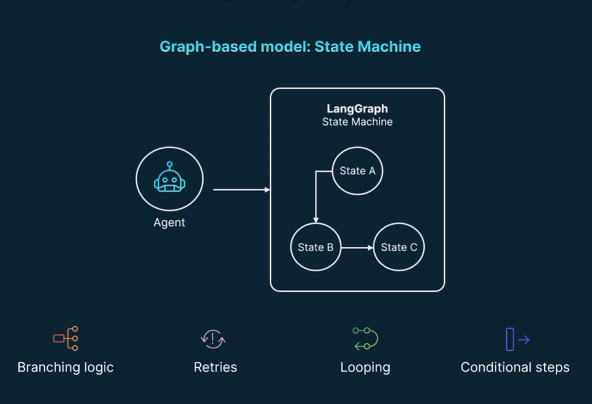
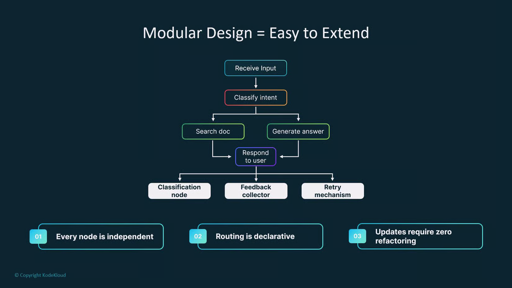
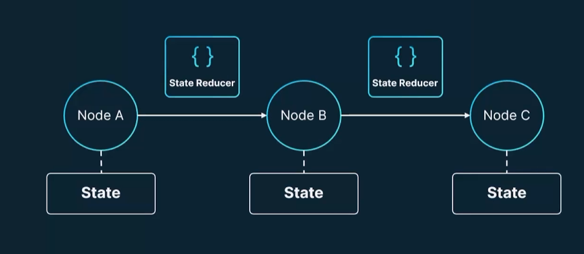
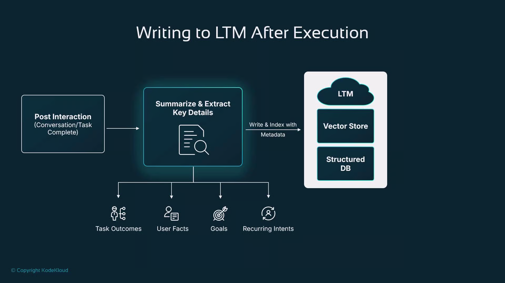
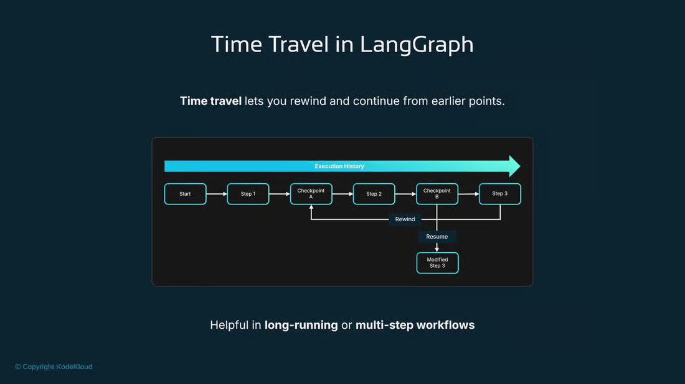

# Langraph Cource

1. Langgraph concept and component
2. Build Path, conditional routes and loops
3. Memory and state resource
4. Human In The Loop
5. Observability Tools

## Structure

1. Graph Premitives
2. Path and Decisions
3. State Management
4. Context and Short Memory
5. Long Term Memory Persistance
6. Human In The Loop
7. Advance debugging

===============================================

# Langgraph concept and component

- LangGraph Provides
    - Structure
    - Flow
        - Multi Step Agent WorkFlow
    - Memory
    - Orcastration

- LangGraph Building Block and Featues
    - Langraph Building Blocks
        - Node: A logical unit or action (llm call, tool execution, data processing)
        - Edge: It define logic for next node.
        - State: It is working context. (Memory, Input/Output, User Data)
            - State Scama: Info on node and edges

    - LangGraph Features
        - Looping and Branching
        - State Persistance
        - Human In Loop
        - Straming Processing
        - LangChain Integration

    - LangGraph UseCase
        - Multi Agent System
        - Approval WorkFlow
        - Resillient Chains
        - Dynamic Documentaion System



- **StateGraph**
    - StateGraph: is the core builder class used to model agent workflows as stateful graphs.
    - Workflow
        - Define State Object
            - Input Variable
            - Output Variable
            - Context Variables
        - Define Nodes
        - Create Trasition and Edge

===============================================

# The Core Workflow: Nodes, Edges, and Routing

- Langchain Premitives
    - LLMChain
    - Tools
    - Retriver
    - Memory
    - Agent
- Non Cyclic LangGraph
    - build graph
    - add nodes
    - add edges
    - Use Case
        - Simple and static flow
        - determistic output
- Decision Maker Cyclic Graph
    - Runtime Decision Point
        - User select
        - LLM Outputs
        - Tool Results
        - Internal State Values
    - Conditional Routing
        conditional edge

- Example:


===============================================

# State Management and Iterative Loops

- GraphState: Passed to all nodes to
    - Input
    - Intent
    - Result
    - Responce
    - History / Memory

- State Accumulation: Nodes update are combinned with previous state.
    - Accumulation Fields
        - chat history
        - tools used
        - step token
        - memory
    - OverAccumulation Methods
        - chat history
        - outdated tool logs
        - Integrate pruning into graph
    - reducers: It is used to achive State Accumulation

- Reducers: It is Rules to define how values update between nodes.
    - Type
        - Build in
        - Custom Reducers
    - Pattern
        - Accumulate
        - Redact
        - Purne
        - Replace



- Handling Multiple State Schemas langgraph: Multiple state need for subgraph and internal node state
    - Multiple Schema
    - SubGraph

```py
builder = StateGraph(
    OverallState,
    input_schema=InputState,
    output_schema=OutputState
)
```

- SubGraph
```py
main_builder.add_node(
    "calculation",
    subgraph
)
```

- Termination Condition

===============================================

# Context Management and Short-Term Memory

- Strategies for Context Overflow: Context overflow occurs when the combined size of your prompt and chat history exceeds a model token window.
    - Prioritize recent turns (truncate from the top)
    - Summarize or compress older exchanges
    - Role-based filtering
    - Chunking with recency bias
    - Memory snapshots and external storage
    - Combine techniques and iterate
    - Trimming and Filtering Removing Irrelevant Messages

===============================================

# Long-Term Memory and Stateful Persistence

- Stateful Persistence Checkpoints: Start, Pause, Resume work
    - UseCases
        - Long WorkFlow
        - External Dependency
        - Multi-session Input
    - Pluggable checkpointers and common backends
        - Redis
        - Cloud Output Storage
        - Databases
        - Custom checkpointers
    - Checkpoint Cases
        - task completion
        - decision points
        - when waiting for user input

- Managing Concurrency and State Isolation per User Session
    - Threads
    - Async tasks (asyncio)
    - Job queues (Celery, RQ)
    - Serverless functions

- Architecting Long Term Memory LTM
    - Common LTM storage formats
        - Vector store (embeddings)
        - Relational/NoSQL DB
        - File system / Object storage
    - Leveraging the LangGraph Store



===============================================

# Human-in-the-Loop (HILT) Architectures

- Real Time Interaction and Feedback
- Pause and Resume
- Human Approval

===============================================

# Advanced Control and Debugging UX

- Enabling State Editing Mid Execution
- Implementing Dynamic Breakpoints Based on Conditions
- The Concept of Time Travel


