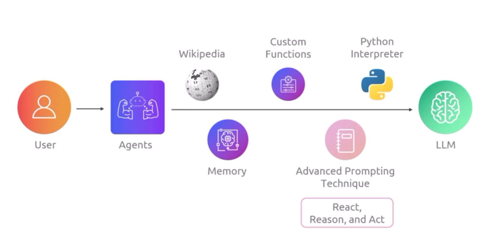

# Agenda

Doc: https://docs.langchain.com/oss/python/langchain/overview

- Key Building Blocks of LLM
- Langchain
- Package Setup
- Model I/O - Prompt

===========================

## Key Building Blocks of LLM

1. User: User or System to use LLM
2. Application
3. Prompt, Response
4. Context: Provide recent data
    - sql, nosql, vector database, website
5. LLM: Large Language Model
6. History: Preserve promt and responce


===========================

# Langchain

- Framework and SDK design to simplify llm integration.
- Framwork, SDK, middleware, orcastration

- Langchain Framework
    - Langsmit: monitoring
    - Langserve: Deployment
    - Langgraph: MultiAgent

- Alternative
    - llamaindex
    - crewAI (Langgraph Alternative, wrapper on langgraph)


## Langchain Library

1. langchain-core
    - LangChain Core is the runtime and the set of base abstractions.  It provides the execution environment for chains, agents, tools, and other high-level constructs.
    - Core defines interfaces and base classes that concrete implementations must follow.
    - One of the most powerful features in Core is LCEL (LangChain Expression Language)

2. LangChain Community
    - The community packages provide concrete implementations that satisfy Core’s abstractions: LLM provider adapters, vector database connectors, document loaders, retrievers, and many tools.
    - Use these community integrations to connect to providers such as OpenAI, Anthropic, Cohere, Amazon Bedrock, Azure OpenAI, and Google Vertex AI.

3. LangChain
    - The main LangChain library builds on Core by providing ready-to-use implementations of many abstractions: chains, agents, retrieval strategies, and other high-level building blocks used to assemble an application’s cognitive architecture.

===========================

# LangChain Ecosystem

- Langsmit: LLMOps Tool
    - Monitor
    - Evaluation
- LangServe: Deployment
    - API (alternative: FastAPI)
- Langgraph: Multi Agent

- CrewAI: Multi Agent (Alternative of Langgraph)

===========================

# Building Block of Langchain

### Model I/O
- Core module of langchain
- Grammer, symtax, structured promt and responce.
- promt eng, and formating responce.

### Chains
- Modular component can stick together to create flow.
- contect prompt, parser, db, llm together to create flow.

### Memory
- Memory module in langchain provide short and long term memory of LLM Chat.
- Short term memory for local memory.
- Long Term memory in persistance storage.

### Tools
- Tools used for integration function, services, API.
- To get data from external source we can bring tools or create custom toold for production apps.

### Retrival
- Bring Context to resolve cutoff point knowledge.


### Agents
- system or software to perform task using AI.
- It check tools and collect data and contanct llm to perform task.

===========================

# Model I/O

- Model I/O manages communication, syntax, prompt, request-responce from LLM.

## Language Model Types

- There are 2 types of Language Model
1. Large Language Model
2. Chat Model

## Types of Message

1. System Message
    - Set Role, Parsona, like as Physician, Technician

2. Human Messages
    - This is query to LLM models.

3. AI Messages
    - This is responce from LLM models.

```py
messages = [
    SystemMessage(content="You are a helpful assistant."), # System Message
    HumanMessage(content="Hello, explain LangChain in one sentence.") # Human Message
]
response = llm.invoke(messages) # AI Message
```

## Prompt Template

### Prompt Types

1. PromptTemplate
2. ChatPromptTemplate
3. HumanMessagePromptTemplate
4. SystemMessagePromptTemplate
5. FewShotPromptTemplate
6. ReAct = Reason and Action


## Parsing and Formating Output
- langchain update output of llm and parse
- output can be parsed to multiple types
- PydanticOutputParser: convert llm output ot python object

example
```
from langchain.output_parsers import CommaSeparatedListOutputParser
from langchain.output_parsers import JsonOutputParser
from langchain.output_parsers import PydanticOutputParser

output_parser = <ParserClass>()
format_instructions = output_parser.get_format_instructions()
print(format_instructions)
```

===========================

# Tips, Tricks, and Resources

- Debug

```py
from langchain.globals import set_debug
set_debug(True)
```

- Verbose
    - langchain.verbose = True

- Callbacks
    - we can add callbacks to handler to get information and check status. As it may have complex path.

===========================

# LangChain Expression Language (LCEL)

- Pipe Syntax
- Chain
    - get input schema
    - get output schema
    - get graph
- Innvocation
    - Synchronous invocation
    - Streaming execution (stream) in chunk
    - Parallel / batch execution (batch)
- Runnable Passthrough
    - Pass
    - Delegate value at runtime
- RunnableLambda
    - Pass custom function to LCEL


- Agenda
    - Runnable
    - LCEL chain: seq of runnable
    - Runnable execution order
    - Runnable execution alternative
    - Build-in Runnable and function
    - Basic LCEL chain operation
```py
chain = prompt | llm | output_parser | RunnableLambda(get_len) | RunnablePassThrough()

chain.get_graph().print_ascii()
```

===========================

# Memory

- History
    - LLM is stateless
    - Context: Pass context to history to avoid haluginate
- Memory Types
    - Short Term
        - RAM and non persistance
        - Pass history in chain.invoke to bring context.
        - MessagesPlaceHolder(variable_name="history")
    - Long Term
        - Persistance
        - Redis, psql
- ConfigurableField
    - Pass configuration at runtime.

===========================

# Retrival

- Context: (Inject context to prompt to reduce halusination)
    - DB
    - Docs
    - API
    - Webpage
    - PDF
- RAG: Framework to retrive data and pass to llm to genarate responce.
- Context Window: Token Size which accepted by llm.
- Token: Smallest size of word in llm.

- RAG Workflow
    - RAG Phase 1: Indexing
        - Load
        - Split to chunk
        - Embed
        - Store
    - RAG Phase 2: Retrival
        - Question convert to vector
        - Retrive matching data from vector
        - Pass data to llm

- Langchain retrival Module
    - Document Loaders
    - Text Splitters
    - Embedding
    - Vector Database
    - Retriver


===========================

# Chains

- Chain Inplementation
    - LangChain Expression Language (LCEL)
    - Build-in-Chain
        - Create Stuff Document Chain: Take multiple document and pass it to single prompt
            - All data in Context Window
        - Create Retrival Chain: Combine crreate and retrival
            - Perform quick look up
            - Symantic Search
    - FAISS is in-memory by default (non-persistent).
        - an efficient local vector store wrapper for high-speed similarity search and clustering of dense vector embeddings.

====================================

# Tools

- Introduction
    - Tools: Configurable module to integrate to external applications.
- RAG vs Tools
    - RAG: Preproceesed and indexed data
    - Tools: Real time access to information
- Tools
    - PythonREPLTool: Enable agent to run python code.
    - Wikipidia Tool
    - Tavily: Search from API
- Build Custom Tools

====================================

# Agents

- LLM Observation and Limitation
    - Stateless
    - Syncronous
    - Hallusination
    - No internet access
    - non deterministis output
- Agents: Perform advance model and interaction to overcome LLM limitation.
    - Bring Modularity
    - Support Integration
    - Scalable
    - Long Term Memory
    - Work Async
- Human In Loop: Keep human in loop.
- Example
    - Customer Service and Counsling
    - Customer Support
    - Student Guide
- Modules
    - PythonREPLTool: Enable agent to run python code.
    - AgentExecutor
    - create_tool_calling_agent: create agent.
- ReAct:  ReAct (Reasoning and Action) prompt




====================================
