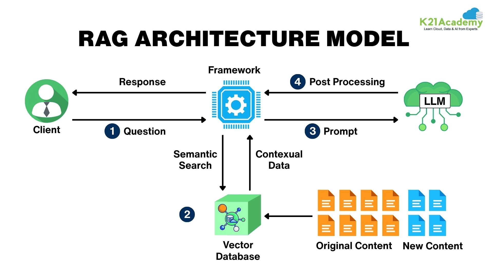
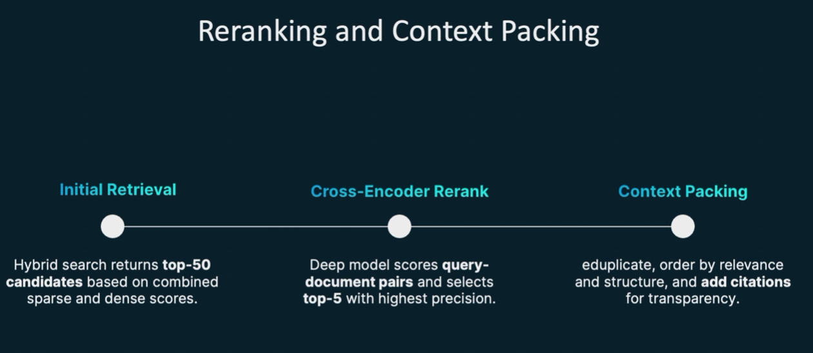
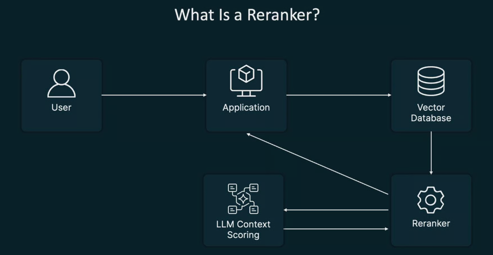
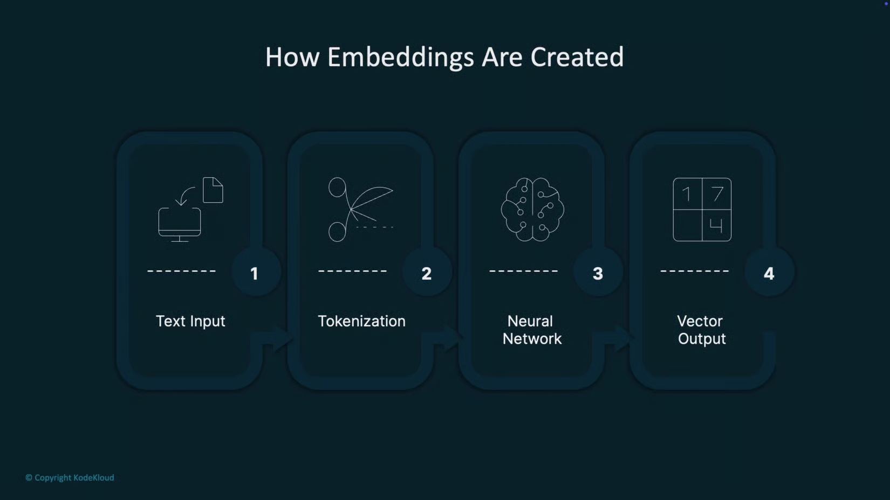
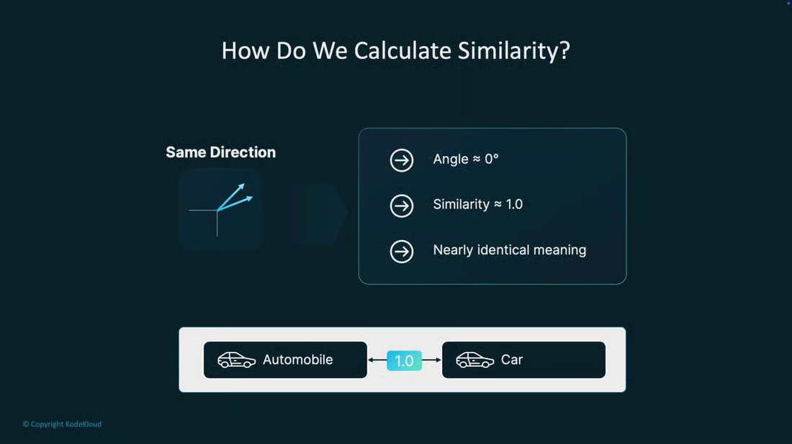

# **Introduction**

### **Ref:**

https://github.com/kodekloudhub/Fundamentals-of-RAG
https://notes.kodekloud.com/docs/Fundamentals-of-RAG

RAG is a common default for "AI + documents" because it scales the knowledge a model can use without large-scale fine-tuning.

### Course:

- RAG Introduction
- Parsing and Chunking Document for LLM to use.
- Improve score, ranking and searches
- Semantic Searching and Embedding
- Vector database for embedding store
- Building RAG pipeline

```
Document -> Chunking -> Embeddings -> Vector Database
```

# RAG

### Core phases:

- **Retrieval**: Search your knowledge base using semantic similarity (often in combination with keywords).
- **Augmentation**: Select, rank, and assemble the most relevant document chunks.
- **Generation**: The LLM composes answers conditioned on the retrieved evidence.

# RAG Architecture



```
Document -> Chunking -> Embeddings -> Vector Database
```

## RAG pipeline — high level

At a high level, RAG is composed of three systems that work together:


| Component         | Purpose                                                                       | Example technologies                      |
| ----------------- | ----------------------------------------------------------------------------- | ----------------------------------------- |
| Knowledge base    | Stores documents, logs, configs as semantic representations (embeddings)      | `S3`, `Google Drive`, `DB`, `PDFs`        |
| Retrieval system  | Performs similarity search over embeddings to find relevant chunks            | `FAISS`, `Pinecone`, `Weaviate`, `Milvus` |
| Generation system | LLM consumes the user query + retrieved context to produce grounded responses | `OpenAI`, `Anthropic`, self-hosted LLMs   |

## Improving retrieval quality

After initial retrieval, use these techniques to improve precision and recall:

- Hybrid search: combine keyword (BM25) with vector search for exact term matching plus semantic coverage.
- Reranking: use an LLM or a learned relevance model to reorder candidates.
- Query expansion: generate alternate phrasings, synonyms, or augmented queries (e.g., doctor ↔ physician).

## Primary challenges in production RAG systems

Common production issues and mitigations:

1. Retrieval quality — wrong or irrelevant documents returned

- Causes: poor chunking, weak embeddings, narrow search.
- Solutions: tune chunking, use hybrid search, reranking, domain-specific embeddings.

2. Context length management — too much or too little context

- Causes: feeding the LLM too many tokens or omitting key context.
- Solutions: dynamic context windowing, relevance scoring, summarize/condense retrieved chunks.

3. Hallucination — the LLM invents facts that aren’t in the sources

- Mitigations: explicit grounding instructions, confidence scoring, model fine-tuning (when available), corroboration checks against evidence.

4. Latency — slow responses in query → embed → search → generate loops

- Causes: repeated embeddings, synchronous pipelines, heavy reranking.
- Solutions: cache embeddings and frequent queries, async workflows, batch embedding, GPU acceleration, index partitioning.

## Implementation checklist

Use this checklist when planning a RAG system:

```
Ingestion: define supported document types and chunking strategy.
Embeddings: choose model(s) suitable for your domain.
Vector DB: confirm latency, scale, and replication needs.
Search strategy: decide on pure vector, hybrid, or multi-stage search.
Reranking & filtering: implement LLM-based or learned rerankers if needed.
Prompt design: require grounding and citations.
Monitoring: track retrieval relevance, hallucination rates, latency.
Security & compliance: protect sensitive embeddings and data access.
```

# RAG vs Alternatives

## Common alternatives to a full RAG pipeline include:

- Fine-tuning:
  adapt a model to your corpus so domain knowledge is internalized by the model. Best for stable datasets and when you need reproducible, deterministic behavior.
- Context window approaches (context-stuffing):
  directly include the most relevant content in the prompt without a retrieval service. Useful for small, focused datasets or single-document tasks.
- Hybrid retrieval / AI search:
  combine semantic search with traditional ranking, filters, and structured queries for robust retrieval without the full RAG complexity.
- Agents / tool-enabled systems:
  orchestrate specialized tools or modules (calculators, databases, APIs) from the model when actions beyond text generation are required.

## Decision framework: practical questions

1. Data characteristics

- Size
- Structure
- Update Frequency: RAG needed for high frequency update.

2. Query patterns
3. Accuracy and auditability
4. Constraints: latency and cost
5. Resource investment and operational complexity

# Demo Ollama Setup and Walkthrough

## Key benefits:

- Run models locally for lower latency and data privacy.
- Use CLI or GUI workflows to pull, run, and manage models.
- Integrate local models into apps via a local API (default: 127.0.0.1:11434).

```sh
$ curl -fsSL https://ollama.com/install.sh | sh
$ ollama

$ ollama list/ps/pull/run/show/stop
```

## Model Catalog:

https://ollama.com/models

## Demo Connecting with Ollama

1. Start ollama

```sh
$ ollama serve
$ ollama list
```

2. Connect with Oolama

- GUI (Windows and macOS) — a simple chat window similar to ChatGPT, Claude, or Gemini.
- CLI — a terminal-based chat interface for quick interactions and scripting.
- REST API — a programmatic HTTP interface for building applications that generate text or conduct multi-turn chats.

```sh
curl -s \
  -H "Content-Type: application/json" \
  http://localhost:11434/api/generate \
  -d '{ "model": "gemma3:latest", "prompt": "tell me a funny joke about Python" }'
```

## Ollama with system

1. MacOs

- M2 to M4 support Unifined memory which combine GPU + RAM.

2. NVDIA

```sh
$ sudo apt install neofetch
$ neofetch
$ nvidia-smi
```

## Practical

1. ollama

```sh
# Setup and pull model
$ curl -fsSL https://ollama.com/install.sh | sh
$ ollama pull gemma4:latest
$ sudo systemctl start ollama

# Setup library
python3 -m venv venv
source venv/bin/activate
pip install ollama
```

- Simple example
  single_prompt.py

```py
# Single generation request
result = ollama.generate(
    model='gemma4:latest',
    prompt='Tell me a funny joke about Python'
)
```

- context example to create chatbot with old context
  context.py

```py
    # Chat like bot by passing all message history in messages list
    response = ollama.chat(model='gemma4:latest', messages=messages)
```

---

# **Document Processing and Chunking**

Parse multiple type of document to make it RAG ready document.

# Ingestion Processing

## Document Processing Fundamentals

This lesson explains how to convert messy source files into clean, machine-readable artifacts suitable for retrieval-augmented generation (RAG).

Why this matters: large language models and vector search expect clean, sequential, and semantically coherent text.

## What successful ingestion produces

- **Extracts readable text** with preserved sections and paragraphs.
- **Preserves logical structure**: headings, sections, lists, and hierarchy.
- **Captures relationships**: table columns and figure-caption pairings.
- **Records document metadata**: source, page numbers, authors, timestamps, document type.

# Three pillars of RAG data

- UnStructured Data: txt, md
- Semi Structured Data: pdf, docx
- Structured Data: csv

# Typical ingestion pipeline pattern

1. **Raw extraction**: choose a parser appropriate for the file type (e.g., pdfplumber for PDFs, python-docx for DOCX, pandas for CSVs).
2. **Layout and structure recovery**: use layout parsers or heuristics to reconstruct sections, columns, tables, and captions.
3. **Chunking**: split content into semantically coherent chunks (by paragraph, heading, or table row), keeping chunk size aligned to your embedding model’s context window.
4. **Metadata enrichment**: attach source, page range, section heading, and other helpful attributes to every chunk.
5. **Indexing**: calculate embeddings and store in a vector store with metadata for filtering and retrieval.

## Parser

- Parse UTF-8 text files and extract stable metadata.
- Split content into semantically coherent, overlapping chunks.
- Preserve context across chunk boundaries to improve embeddings and retrieval.

### Ingesting: Parser Demo

1. Ingesting Text: Document Parser for text

Building a production-ready text file parser in Python designed for retrieval-augmented generation (RAG) pipelines.

```sh
python text_ingestion.py
```

2. Ingesting Docx: Parser for Docx

```sh
# Install the DOCX parser dependency
pip install python-docx

python docx_ingestion.py
```

3. Ingesting PDF: Parser for PDF

```sh
# Install the PDF parser dependency
pip install PyPDF2 langchain

python pdf_ingestion.py
```

4. Ingesting CSV: Parser for CSV

```sh
# Install the CSV parser dependency
pip install PyPDF2 langchain

python csv_ingestion.py
```

# Chunking Strategies: Preparing text for LLM ingestion

## Practical benefits of chunking:

- Respect model context limits (tokens).
- Speed up retrieval and ranking (smaller units are faster to search).
- Reduce noise.

## A strong chunk usually exhibits:

- **Coherence**: self-contained and semantically complete
- **Appropriate size**: fits your target token limit
- **Overlap**: intentional overlap with adjacent chunks (commonly ~10–20% or 1–2 sentences) so multi-sentence concepts don’t disappear across boundaries.
- **Natural boundaries**: prefer paragraph, heading, code block, or section boundaries when available.
- **Provenance metadata**: include source, document id, section/title, page number, timestamps, etc., so retrieved chunks can be traced to their origin.

Typical chunk sizes by use case


| Use case                                  | Typical chunk size (tokens) | Notes                                                    |
| ----------------------------------------- | --------------------------: | -------------------------------------------------------- |
| Q\&A / retrieval                          |                    256–512 | Good for short factual lookups and fast ranking.         |
| Summarization / single-document synthesis |                      1k–4k | Larger chunks preserve longer context for summarization. |
| Long documents / book-scale               |                     512–1k | Combine chunking with retrieval or multi-hop approaches. |

## Core chunking strategies

### 1. Fixed-size chunking

* What it is: Split text into fixed N-character or N-token chunks, optionally with a fixed overlap.
* When to use: Quick ingestion pipelines, or when document structure is unavailable and speed/predictability is critical.
* Pros: Simple, predictable, and fast to compute.
* Cons: Semantically blind — may break sentences and reduce coherence.

Example (fixed-size chunking with overlap):

```python
chunk_size = 1000  # characters or tokens depending on your splitter
overlap = 100
chunks = split_fixed(text, chunk_size, overlap)
```

### 2. Context-aware splits (paragraph / sentence splitting)

* What it is: Use natural textual delimiters — paragraphs, sentences, and line breaks — to create chunks.
* Pros: Preserves linguistic boundaries and improves coherence compared to fixed-size splits. Easy to implement with standard NLP tools.
* Cons: Chunk sizes vary; long paragraphs may still exceed token limits and require further splitting.

Best practices:

* Combine paragraph/sentence splitting with a tokenizer check to ensure chunks fit your token budget.
* Apply small overlaps (1–2 sentences) to prevent loss of cross-boundary context.

### 3. Recursive split (recommended default)

* What it is: Multi-pass splitting that preserves the largest natural units first and only splits deeper when chunks exceed size constraints.
* Typical pass order: headings/sections → paragraphs → lines → sentences → words.
* Why use it: Balances coherence and size constraints by adapting to document structure and avoiding blind truncation.
* When to use: Default for most RAG pipelines — a strong choice for \~80% of use cases.

### 4. Header / Markdown splitting

* What it is: Use document structure (Markdown H1/H2/H3, or other structured headings) to keep headings and their content together.
* Pros: Excellent for technical docs, API references, and knowledge bases — preserves hierarchy and section context.
* Cons: Fails on unstructured prose and depends on well-formatted source documents.

When working with Markdown knowledge bases, prefer header-based splitting first and then apply recursive or sentence-level splitting inside large sections.

### 5. Semantic / topic-shift splitting (advanced)

* What it is: Use embeddings to detect semantic similarity and place boundaries where similarity drops below a threshold.
* Process:
  1. Embed sentences or small units (e.g., with SentenceTransformers).
  2. Compute cosine similarities between adjacent embeddings.
  3. Insert a chunk boundary when similarity falls under a tuned threshold that indicates a topic shift.
* Pros: Produces highly coherent, concept-aligned chunks — ideal for long content with shifting themes.
* Cons: Computationally expensive and sensitive to embedding-model quality and threshold tuning.

Recommended resources:

* SentenceTransformers: [https://www.sbert.net/](https://www.sbert.net/)

# Practical

```
rag-project
```

# **Keyword Search & Retrieval**

This lesson explains retrieval methods and the critical design considerations for building retrieval-augmented generation (RAG) systems

Step for RAG Pipeline where optimization needed:

- **Ingest**: split documents into chunks, create embeddings, and index them.
- **Query**: : convert user query to keywords + vector, perform filtered searches, and re-rank candidates.
- **Generation**: pack and send the assembled context + query to the LLM to produce a grounded answer.

## Key system design dials

- **Latency**
- **Cost**
- **Trust**

## Cross-cutting concerns

- **Security**: enforce who can see what (ACLs, filtering, query-time authorization).
- **Caching**: accelerate the fast path to reduce latency and cost.
- **Observability**: instrument ingest, retrieval, re-ranking, and generation for latency, error rates, and data correctness.

## Retrieval methods

- **Sparse search** (keyword-based): precise for exact tokens, code snippets, error strings, and legal text.
- **Dense retrieval** (embeddings): finds semantic matches and paraphrases; good for natural-language questions and cross-lingual queries.
- **Hybrid search**: fuses sparse + dense signals (often via score fusion). A safe default because it captures both exact matches and paraphrases.

Recommendation: start with hybrid search for broad coverage, monitor failure modes, and then optimize weights and tuning based on real traffic data.

# Vector search common ANN index families

- HNSW (Hierarchical Navigable Small World):
  Default for many production setups where recall and latency matter
  Excellent recall and low-latency queries; higher memory footprint
- IVF / IVF-PQ
  Very large corpora where memory is constrained
  More memory-efficient, can be faster at scale if tuned; higher tuning complexity

## Important tuning knobs

- K (candidates):
  number of nearest neighbors returned by the ANN search. Typical starting points: K=50 for re-ranking pipelines, K=10 for direct results.
- efSearch / nprobe:
  controls internal search breadth. Higher values increase recall at the cost of latency (efSearch for HNSW; nprobe for IVF/IVF-PQ).

Start with HNSW defaults, measure P95 latency and Precision@K on real traffic, then tune K and efSearch/nprobe against your SLAs.



# Ranking

Reranking is a two-step information retrieval technique used in search engines and AI systems (like RAG) to improve the precision of results. An initial broad search fetches many possible documents, while a specialized reranker model re-evaluates and reorders them so the most contextually relevant information appears at the top



- A user submits a query to an application.
- The application encodes the query and queries a vector database or first-stage retriever.
- The retriever returns the top K candidate documents or passages (fast, high-recall).
- A reranker evaluates the top K candidates using richer contextual information and assigns relevance scores.
- The pipeline selects the top N reranked items (N ≤ K) for final answer generation or display.

## Why reranking is necessary

- Vector similarity: multiple similar search
- reorder candidates by true relevance.
- This reduces noise

## Related reading and tools

- Retrieval-Augmented Generation (RAG) concepts and best practices: https://www.retrieval-augmented-generation.example (replace with your internal docs)
- Cross-encoders and pairwise ranking models: https://huggingface.co/docs
- Vector databases and ANN indices (Pinecone, Milvus, Faiss) for first-stage retrieval

## ReRanking Algorithm

- TF-IDF
- BM25

```
https://github.com/kodekloudhub/Fundamentals-of-RAG/tree/main/SearchTool
```

# **Chapter: Semantic Search & Embeddings**

## Keyword Search

### Limitations of Keyword Search

1. Lexical mismatch (synonyms, acronyms)
2. Polysemy and context blindness
3. Long documents and passage granularity
4. Noisy language (typos, variants, cross-language)

### When to keep using keyword search

* Exact lookups: IDs, SKUs, and log lines.
* Compliance and audit workflows where deterministic operator semantics (AND/OR/NOT) matter.
* Power users familiar with precise query syntax and domain jargon.
* Very large-scale, low-latency lookups that depend on inverted indexes for performance.

## Embeddings Models

### What is an embedding?

An embedding is a numerical vector representation of text: an array of floating-point numbers (often hundreds or thousands of dimensions) that encodes semantic meaning.

Higher similarity scores indicate closer semantic meaning (e.g., a higher score between “dog” and “cat” than between “dog” and “car”).

### How are embeddings created?

Typical production flow for generating embeddings:

* Tokenize raw text into subword units.
* Feed tokens into a neural network trained on large corpora.
* Produce a dense vector that captures semantic relationships across tokens and context.



```python
from openai import OpenAI

client = OpenAI()
embedding = client.embeddings.create(
    input="The quick brown fox jumps over the lazy dog",
    model="text-embedding-3-large"
)

# The API response contains the embedding vector:
# embedding.data[0].embedding -> [0.032, -0.112, 0.540, 0.891, -0.234, 0.678, ...]
# (vector truncated; embeddings may have hundreds or thousands of dimensions)
```

### Storage and retrieval: vector databases

Embeddings are most useful when stored in vector databases designed for similarity search at scale.

`Pinecone`, `FAISS`, `Chroma`

## Sentence Transformers

Sentence Transformers specialize in encoding entire sentences or short passages into single, fixed-length vectors that are optimized for similarity matching and retrieval — a core capability for retrieval-augmented systems.

Start with two sentences that express the same idea:

* “The cat sat on the mat.”
* “A feline rested on the rug.”

On the surface these use different words, but semantically they’re equivalent: mat ↔ rug, cat ↔ feline, sat ↔ rested.

Sentence Transformers map entire sentences to fixed-length vectors so semantically similar sentences lie close together in vector space.

### Transformer models


| Model                               | Best for                 | Notes                                                        |
| ----------------------------------- | ------------------------ | ------------------------------------------------------------ |
| `all-MiniLM-L6-v2`                  | General semantic search  | Fast and efficient; strong speed/accuracy balance.           |
| `multi-qa-MiniLM-L6-cos-v1`         | QA and FAQ retrieval     | Tuned for question-answer style retrieval tasks.             |
| `all-mpnet-base-v2`                 | High-accuracy similarity | Higher accuracy at the cost of more compute and latency.     |
| `distiluse-base-multilingual-cased` | Multilingual search      | Supports many languages; heavier than single-language minis. |

### Summary

Sentence Transformers are neural encoders that turn sentences or short passages into fixed-length semantic vectors. Using a dual-encoder architecture and training on similarity tasks (NLI, paraphrase detection, STS), they place similar meanings close together in vector space. This enables retrieval by meaning rather than keyword matching, making them a foundational component of semantic search and retrieval-augmented systems.

## Similarity Calculations

A simple analogy: imagine two darts thrown at a board. If they land in the same place and point the same way, the throwers were thinking similarly. In vector terms, similarity examines the direction (angle) between vectors rather than raw magnitude.



The standard numerical measure for directional similarity is cosine similarity:

```python
cosine_similarity(A, B) = (A · B) / (||A|| * ||B||)
```

You can compute cosine similarity easily in Python:

```python
import numpy as np

def cosine_similarity(a: np.ndarray, b: np.ndarray) -> float:
    return float(np.dot(a, b) / (np.linalg.norm(a) * np.linalg.norm(b)))

# Example (small synthetic vectors)
vec_cat = np.array([0.9, 0.1, 0.0])
vec_kitten = np.array([0.88, 0.12, -0.01])
vec_dog = np.array([0.7, 0.2, 0.1])

print(cosine_similarity(vec_cat, vec_kitten))  # close to 1.0
print(cosine_similarity(vec_cat, vec_dog))     # lower than cat/kitten
```


| Cosine similarity range | Interpretation                                              |
| ----------------------- | ----------------------------------------------------------- |
| 0.8 — 1.0              | Very high semantic similarity (near-synonyms, same concept) |
| 0.5 — 0.8              | Moderate similarity (related topics, overlapping concepts)  |
| 0.0 — 0.5              | Weak or tangential relation                                 |
| -1.0 — 0.0             | Opposite or unrelated meanings                              |

## BM25 vs Semantic Search

**BM25** (Best Matching 25) is a ranking algorithm used in information retrieval systems to determine how relevant a document is to a given search query.

It is the default scoring method for major search platforms like [Elasticsearch](https://www.elastic.co/search-labs/blog/bm25-ranking-multiplicative-boosting-elasticsearch) and Apache Lucene

**Semantic search** is <mark>an advanced information retrieval technique that understands the contextual meaning and intent behind your query, rather than simply matching exact keywords</mark>.

```bash
!pip install -q sentence-transformers rank-bm25 scikit-learn numpy
```

**Corpus, queries, and imports**

```python
from rank_bm25 import BM25Okapi
from sentence_transformers import SentenceTransformer, util
import numpy as np

docs = [
    "Enable two-factor authentication (2FA) in your account settings to add an extra security step.",
    "HbA1c measures long-term glucose; talk to your physician about tests for glycated hemoglobin.",
    "Our PTO policy covers paid time off for vacations and sick leave.",
    "How to fix engine misfires caused by bad spark plugs.",
    "Kubernetes Ingress configuration for path-based routing.",
    "Configure MFA with authenticator apps.",
    "Doctor appointment scheduling policy."
]

queries = ["How do I set up 2FA?", "What does HbA1c mean?", "sick leave policy?"]
```

**Prepare BM25 and SentenceTransformer embeddings**

```python
# Prepare BM25
tokenized_corpus = [d.lower().split() for d in docs]
bm25 = BM25Okapi(tokenized_corpus)

# Choose a model (fast general-purpose)
model = SentenceTransformer('all-MiniLM-L6-v2')
doc_emb = model.encode(docs, convert_to_tensor=True, normalize_embeddings=True)
```

**Helper: show results for a query (BM25, semantic, and weighted hybrid)**

```python
def show_results(query, k=3, alpha=0.8):
    """
    Show BM25 top-k, semantic top-k, and hybrid top-k for `query`.
    alpha: semantic weight in [0,1] for hybrid. hybrid = alpha*semantic + (1-alpha)*bm25
    """
    print(f"\nQUERY: {query}\n" + "="*60)
    # BM25 scores
    bm25_scores = np.array(bm25.get_scores(query.lower().split()))
    top_bm25 = np.argsort(-bm25_scores)[:k]
    print("BM25 top-k:")
    for i in top_bm25:
        print(f"  [{i}] {bm25_scores[i]:.3f}  {docs[i]}")

    # Semantic (SentenceTransformer) scores (cosine similarity)
    q_emb = model.encode([query], convert_to_tensor=True, normalize_embeddings=True)
    cos = util.cos_sim(q_emb, doc_emb)[0].cpu().numpy()
    top_st = np.argsort(-cos)[:k]
    print("\nSemantic (SentenceTransformer) top-k:")
    for i in top_st:
        print(f"  [{i}] {cos[i]:.3f}  {docs[i]}")

    # Normalize both scores into [0,1] to combine them
    bm25_min, bm25_max = bm25_scores.min(), bm25_scores.max()
    bm25_norm = (bm25_scores - bm25_min) / (bm25_max - bm25_min + 1e-9)

    st_min, st_max = cos.min(), cos.max()
    st_norm = (cos - st_min) / (st_max - st_min + 1e-9)

    # Hybrid: semantic-weighted combination
    hybrid = alpha * st_norm + (1.0 - alpha) * bm25_norm
    top_h = np.argsort(-hybrid)[:k]
    print(f"\nHybrid (BM25 + Semantic) top-k (alpha={alpha}):")
    for i in top_h:
        print(f"  [{i}] {hybrid[i]:.3f}  {docs[i]}")
```

```python
for q in queries:
    show_results(q, k=3, alpha=0.8)
```

```python
QUERY: How do I set up 2FA?
============================================================
BM25 top-k:
  [3] 1.487  How to fix engine misfires caused by bad spark plugs.
  [0] 0.000  Enable two-factor authentication (2FA) in your account settings to add an extra security step.
  [5] 0.000  Configure MFA with authenticator apps.

Semantic (SentenceTransformer) top-k:
  [0] 0.689  Enable two-factor authentication (2FA) in your account settings to add an extra security step.
  [5] 0.583  Configure MFA with authenticator apps.
  [3] 0.064  How to fix engine misfires caused by bad spark plugs.

Hybrid (BM25 + Semantic) top-k (alpha=0.8):
  [0] 0.720  Enable two-factor authentication (2FA) in your account settings to add an extra security step.
  [5] 0.670  Configure MFA with authenticator apps.
  [3] 0.574  How to fix engine misfires caused by bad spark plugs.
```


| Method                | Strengths                                                        | When to use                                                     |
| --------------------- | ---------------------------------------------------------------- | --------------------------------------------------------------- |
| BM25                  | Fast, interpretable, strong on exact matches and term importance | Short queries, domain with consistent terminology               |
| Semantic (bi-encoder) | Handles synonyms, paraphrase, and deeper meaning                 | Natural-language queries, varied vocabulary                     |
| Hybrid (weighted)     | Combines both signals, tunable with`alpha`                       | Real-world retrieval where both surface form and meaning matter |


## Keyword to Semantic Search

```bash
%pip install whoosh sentence-transformers scikit-learn pandas
```

RAG/SymanticSearch/KeywardSearch.py

RAG/SymanticSearch/SymanticSearch.py

RAG/SymanticSearch/Comparision.py


# **Vector Databases**

A vector database is specialized storage built to store and search embeddings — dense numerical vectors that capture semantic meaning.

Text, images, audio, and other content are encoded into vectors (embeddings) using an embedding model.

Those vectors represent semantic relationships and can be compared by distance or similarity measures.


## Key features:

* Specialized storage for embeddings and vector indexes.
* Rich connections: each vector links to the original document or content and includes searchable metadata.
* Optimized search: engineered for efficient nearest-neighbor retrieval at scale.
* Semantic retrieval: find contextually relevant passages based on meaning rather than keyword overlap.


## Vector database workflow (high level)

1. Corpus: collect your raw data — documents, images, video, audio, log snippets, etc.
2. Encoding: transform each item into an embedding vector using an embedding model or encoder.
3. Storage: store embeddings alongside metadata (document IDs, timestamps, authors) in the vector database.
4. Query: encode a user’s textual query into a query vector.
5. Similarity search: compare the query vector to stored vectors (typically cosine similarity or Euclidean distance) and retrieve the top-k most relevant items.


## Best practices for building vector search and RAG systems

* Optimize chunk size
* Choose domain-tuned embeddings
* Leverage metadata filters
* Refresh embeddings
* Monitor and iterate

## Vector Database:


* ChromaDB (local-first)
* Cloud-provider-managed options
  * Azure AI Search
  * Vertex AI Vector Search
  * AWS OpenSearch and MongoDB Atlas
* Self-hosted solutions
  * Qdrant
  * Milvus
  * Hybrid systems (Weaviate, Vespa, Elasticsearch/OpenSearch)
* Local / embedded alternatives
  * FAISS
  * pgvector
  * Redis
* Managed services
  * Pinecone


**
