# MCP

## Introduction

doc: https://modelcontextprotocol.io/docs/getting-started/intro

MCP (Model Context Protocol) is an open-source standard for connecting AI applications to external systems.

It allow llm to communicate with external source.

Host Application with LLM > MCP Client > MCP Server > External Tool

### MCP Examples:
- File system access
- Github Integration
- Web Search
- Database Access

### AI Agent:
AI agent automation which take inpute from user and communicate with third party tools and communicate with LLM to take decision and take action.
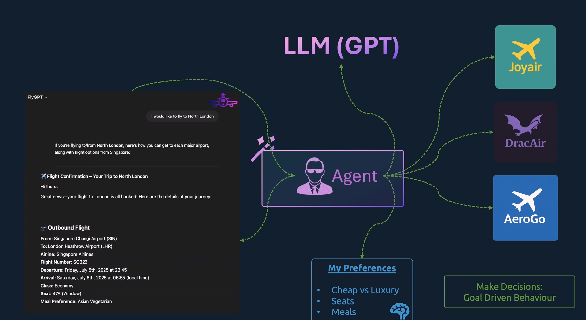

### MCP
It is framework that allows AI agent or user to communicate to third party application to get details.
Agent --> MCP --> Application

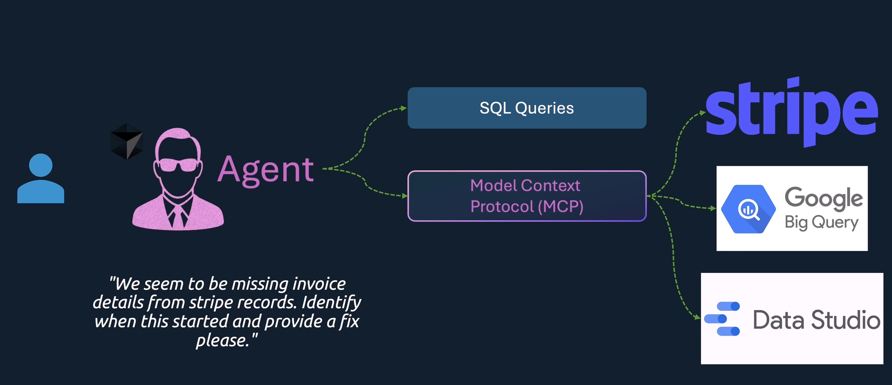

Model - LLM
Context - AI Context
Protocol - standred followd by all AI Agent.

## MCP Keys:

- Server, Client, JSON-RCP

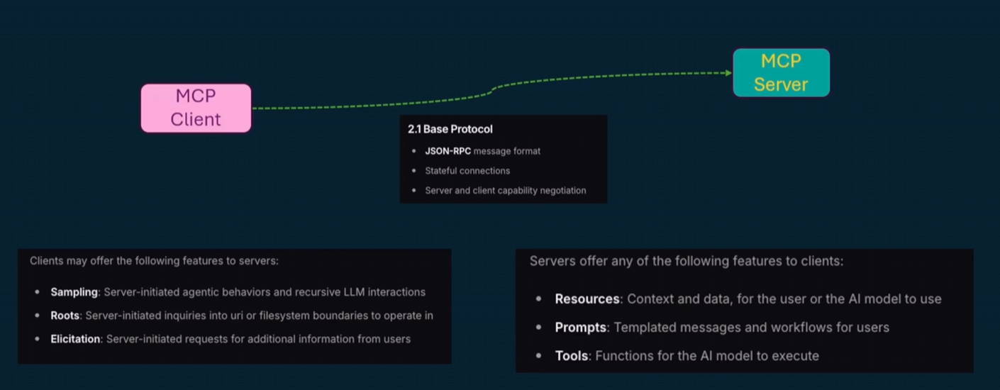

# MCP Architecture
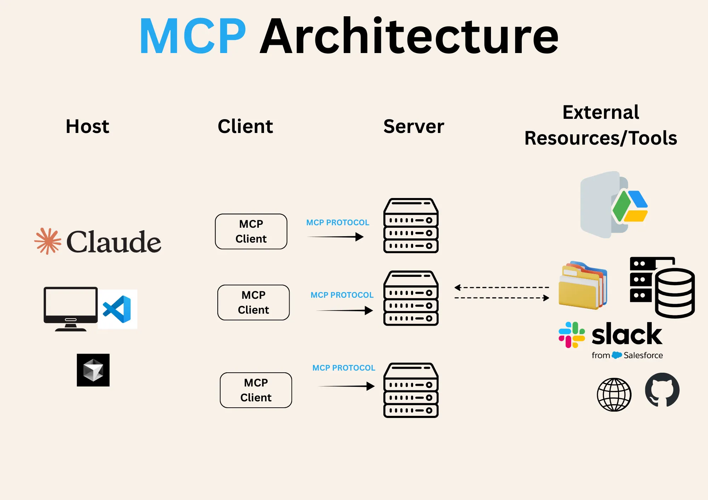

# MCP Server

## Component of MCP Server

- Tools

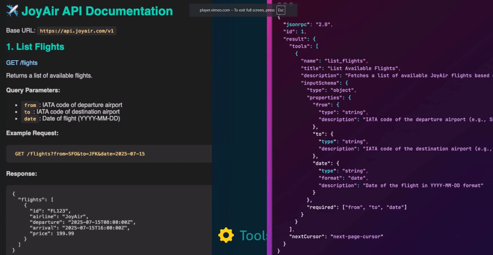

- Resource

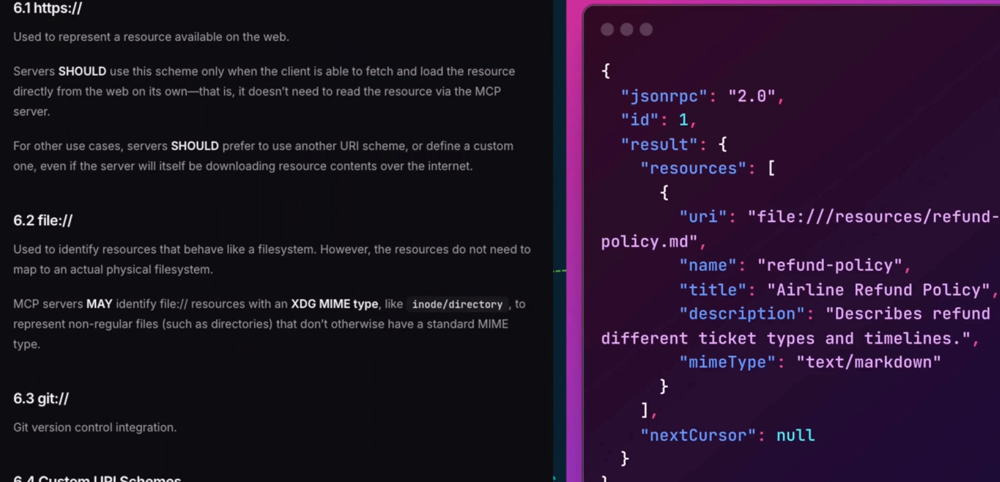

- Promts

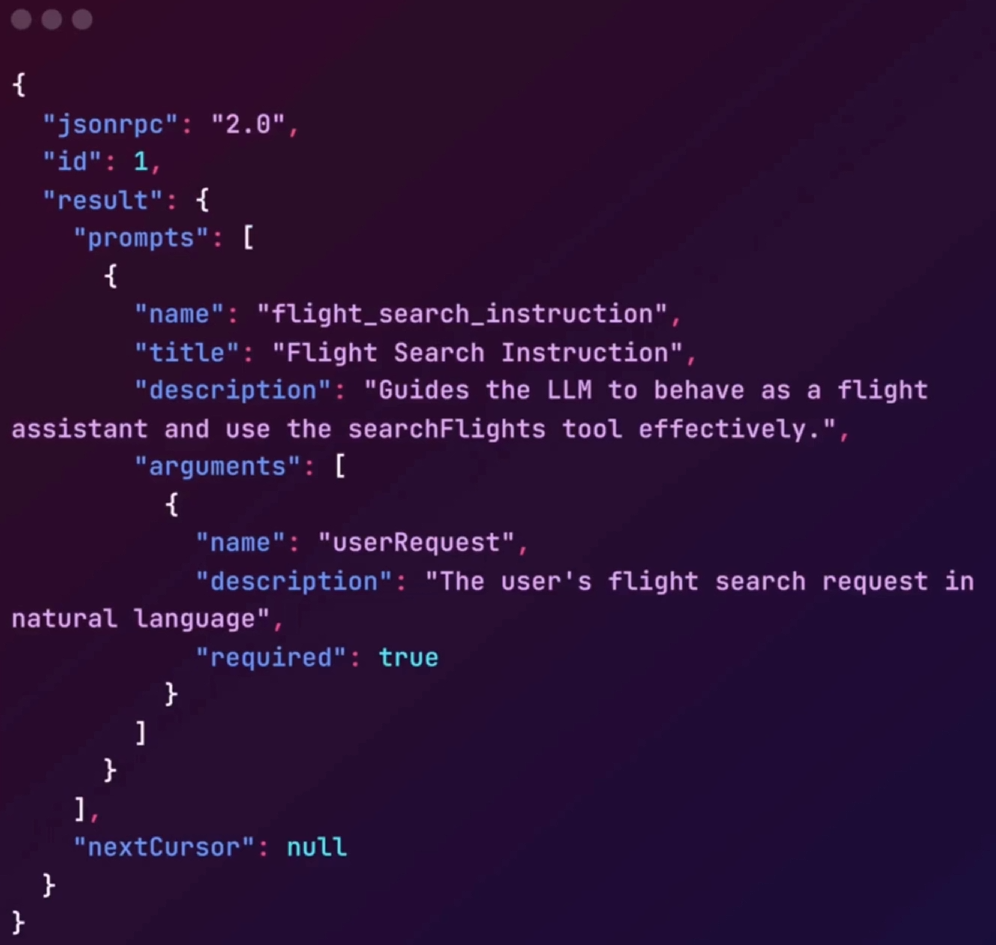

## Type of MCP Server

### STDIO

Uses standard input/output streams for direct process communication between local processes on the same machine, providing optimal performance with no network overhead.

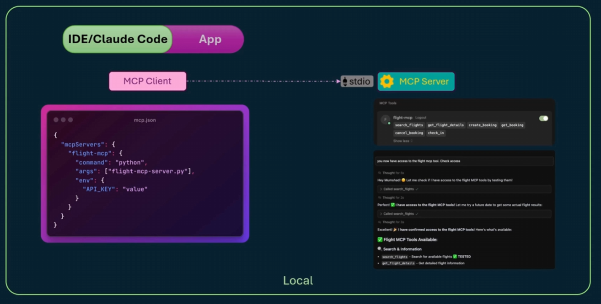

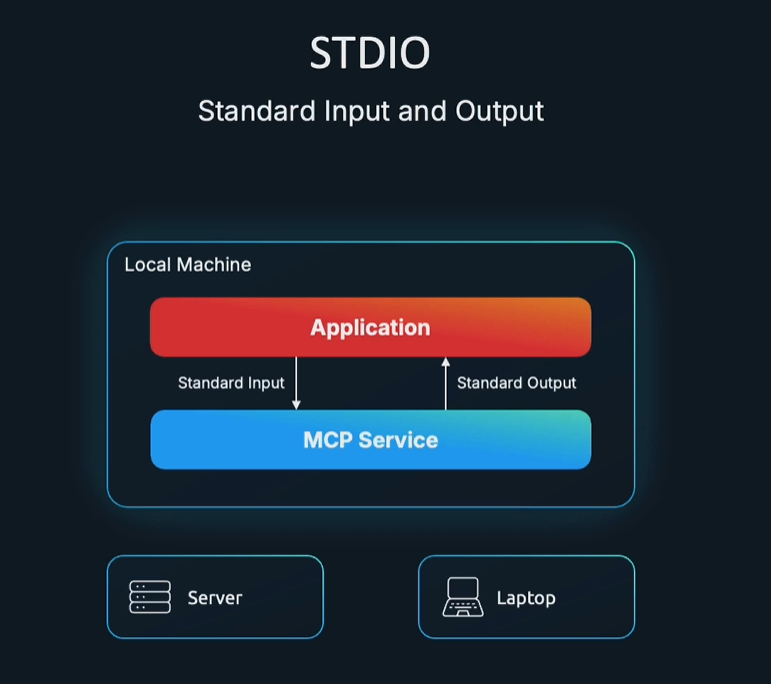

### HTTP

Uses HTTP POST for client-to-server messages with optional Server-Sent Events for streaming capabilities. This transport enables remote server communication and supports standard HTTP authentication methods including bearer tokens, API keys, and custom headers. MCP recommends using OAuth to obtain authentication tokens.

eg of running remotely:
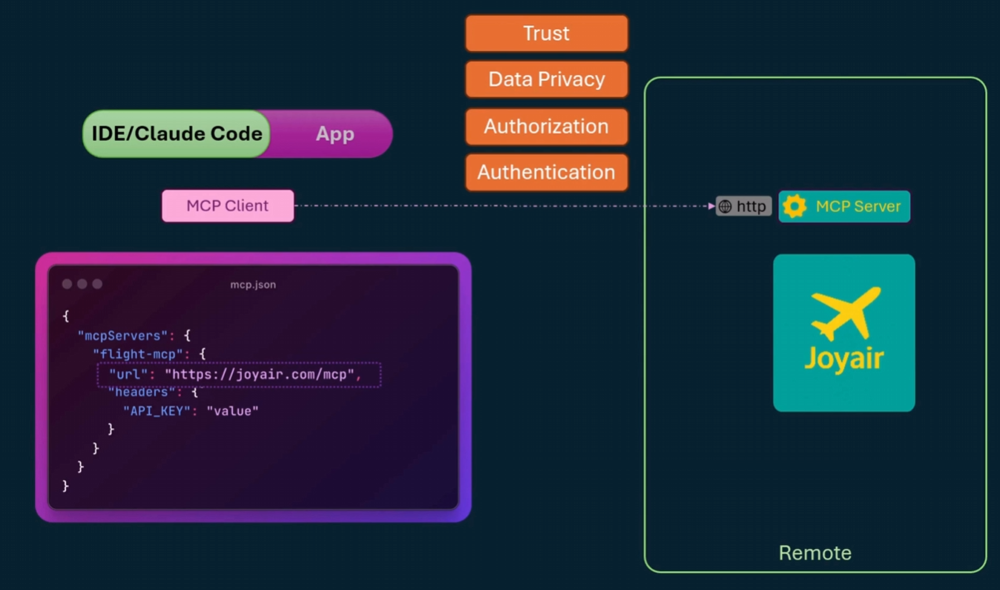

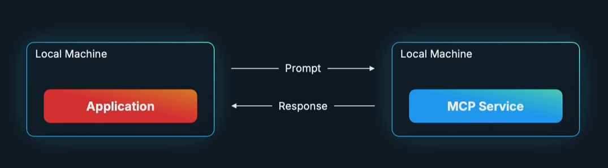


### SSE

It is similar to https connection but initally connection is made and then kept persistance.

Used in chat bot, or long connections.

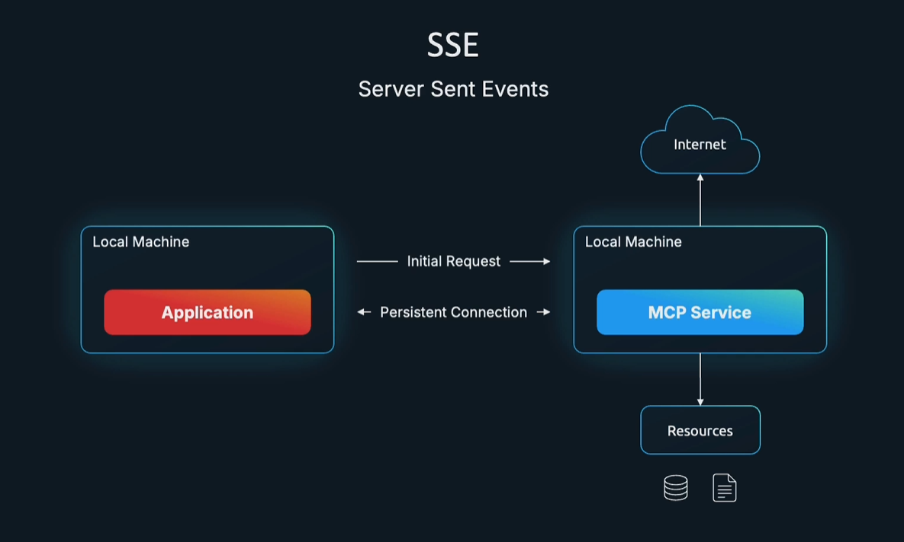

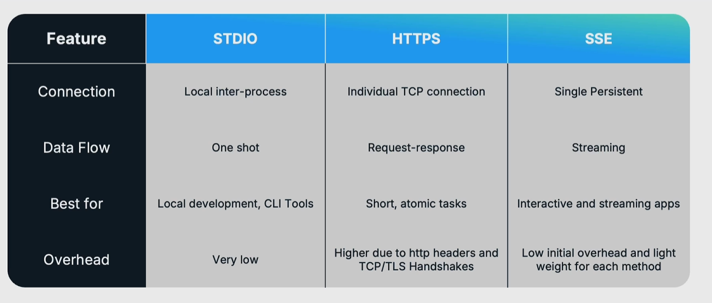

`Note`: HTTPS and SSE can be work in 2 ways:

1. Run server locally
2. Run server remotely
        - When running on remote then need to take care of data privecy, trust, authrization, authentication.


## Build MCP Server

- install uv

```sh
sudo snap install astral-uv --classic
```

- create mcp server
```sh
cd /home/lab-user
uv init flight-booking-server
# Check flight-booking-server server.py example
cd flight-booking-server
uv add "mcp[cli]"
```

- start mcp server with instecter
```sh
mcp dev server.py
```

- start mcp server using streamable-http
```sh
cd /home/lab-user/flight-booking-server
uv run mcp run server.py --transport streamable-http
```

- start mcp using vscode settings
```json
{
	"servers": {
		"flight-booking-mcp": {
			"type": "stdio",
			"command": "uv",
			"args": [
				"run", "python", "server.py"
			],
			"cwd": "/home/ajayp/src/AIProjects/MCP/flight-booking-server/"
		}
	},
	"inputs": []
}
```

# MCP Client

MCP clients are instantiated by host applications to communicate with particular MCP servers.

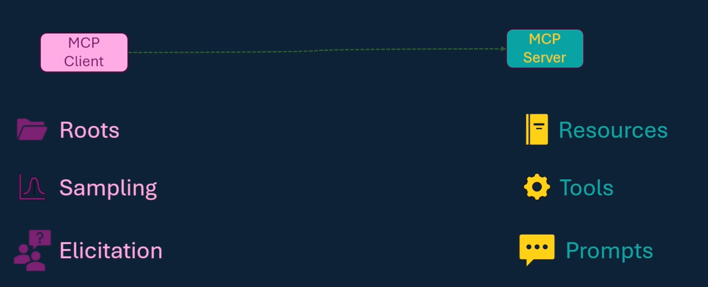

## Way to use client

1. Inspecter or postman
```
npx @modelcontextprotocol/inspector

mcp dev server.py # inspecter
```

2. IDE Tools like code, windserf

```json
{
	"mcpServers": {
    "flight-booking-mcp": {
			"type": "stdio",
			"command": "uv",
			"args": [
				"run", "python", "server.py"
			],
			"cwd": "/home/ajayp/src/AIProjects/MCP/flight-booking-server/"
		},
    "k8s-mcp-server": {
      "command": "sudo",
      "args": [
        "docker",
        "run",
        "-i",
        "--rm",
        "-v",
        "/home/lab-user/.kube/config:/home/appuser/.kube/config:ro",
        "ginnux/k8s-mcp-server:latest",
        "--mode",
        "stdio"
      ]
    }
  }
  }
}
```

3. Create own mcp client

https://modelcontextprotocol.io/docs/develop/build-client

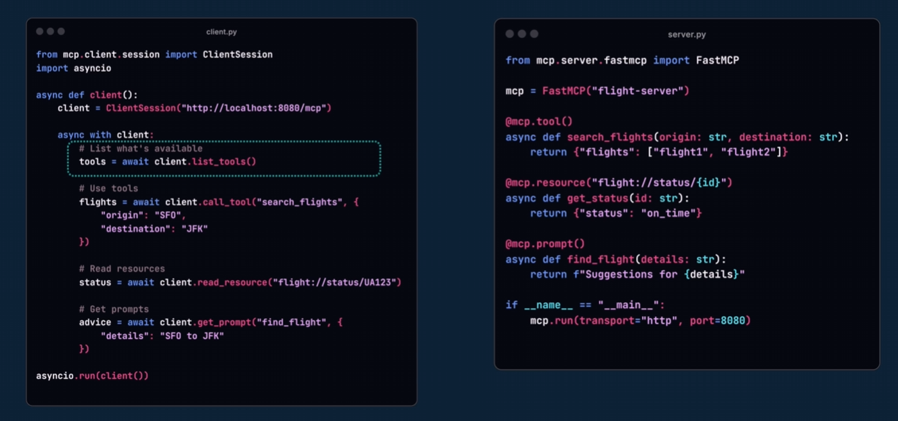


```sh
cd /home/lab-user
uv init mcp-client
cd mcp-client
uv add mcp[client]
```

```sh
uv run client.py
```

## Component in MCP Client

1. Roots
- expose client side floders with server to access data.
- acts like shared folder.

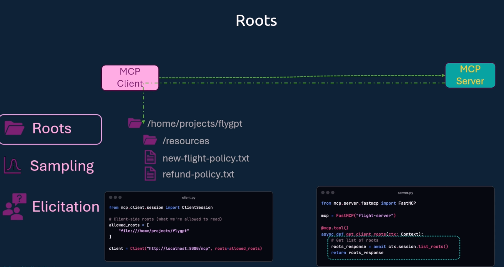

2. Sampling
- Server can't directly interact with LLM directly but it uses client to connect to llm and get details.
- Client have control of llm and AI session, server send request to client to generate data.

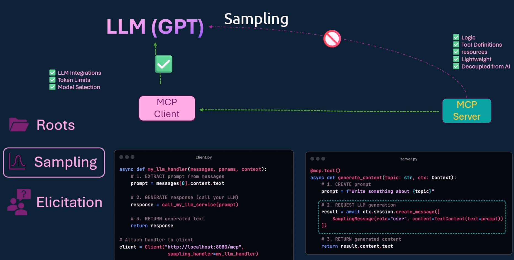

3, Elicitation
- Server may need additional information from server to take further decision.

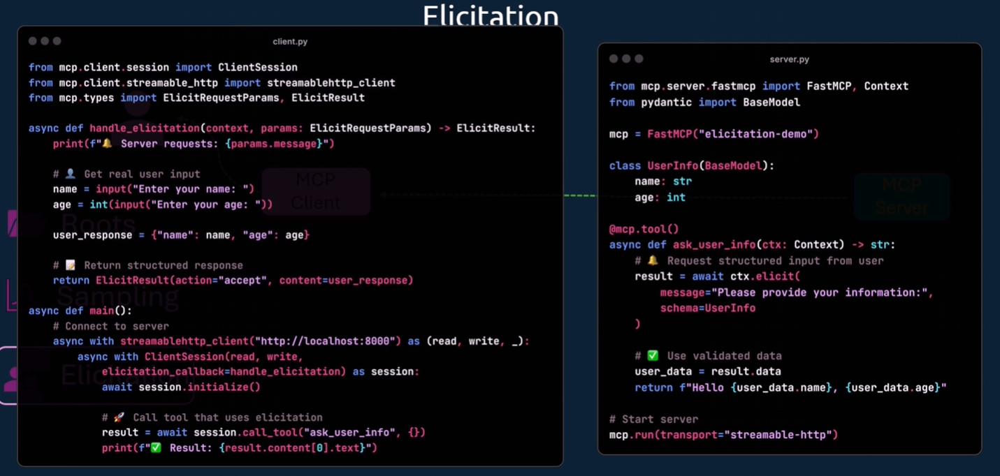

# Context

- Send periodic update for long live task between server and client.
- It send info, debug message

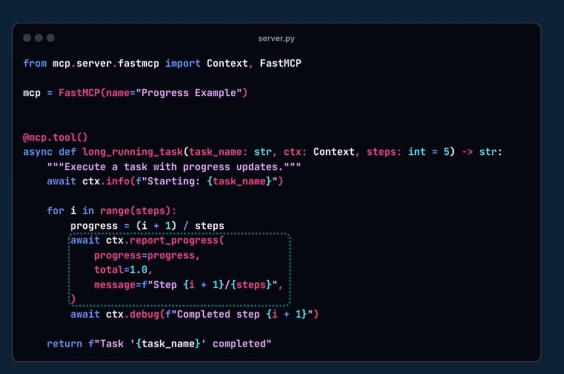
